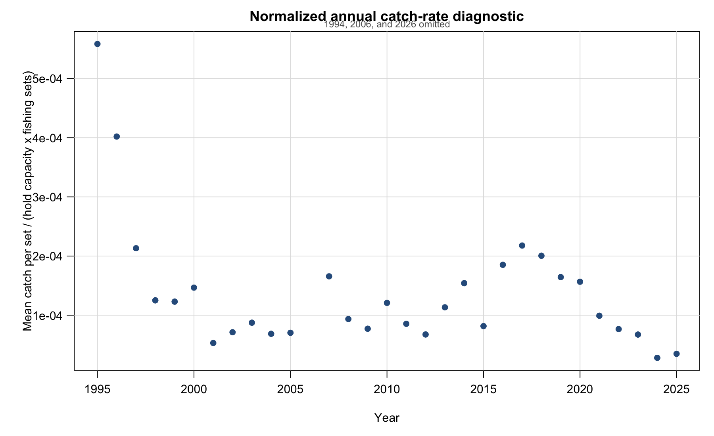
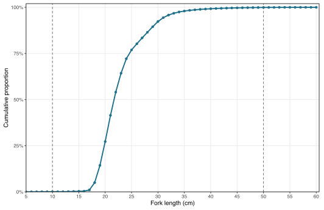
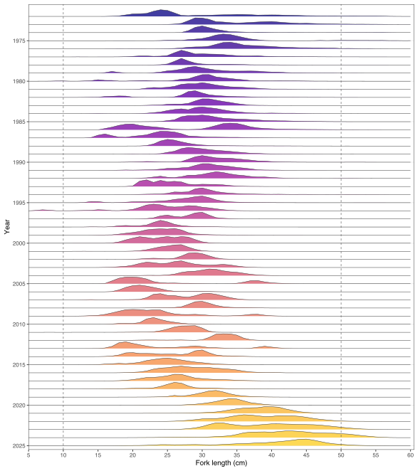

```{r}
date_stamp <- format(Sys.Date(), "%d %B %Y")
time_stamp <- format(Sys.time(), "%H:%M %Z")
```



::: {.content-visible when-format="pdf"}
```{=latex}
\thispagestyle{empty}
\begin{center}
\begin{minipage}[c]{0.18\textwidth}
\centering
\includegraphics[width=\linewidth]{annex/logo.png}
\end{minipage}\hfill
\begin{minipage}[c]{0.76\textwidth}
{\Huge \textbf{SPRFMO}}\par
{\large South Pacific Regional Fisheries Management Organisation}\par
\vspace{0.4em}
{\Large \textbf{Jack Mackerel Working Group}}
\end{minipage}
\end{center}
\noindent\rule{\linewidth}{1pt}
\begin{center}\Large\bfseries Benchmark meeting report 2026\end{center}
```
:::

::: {.content-visible when-format="docx"}
| {width=1.35in} | **SPRFMO**<br>South Pacific Regional Fisheries Management Organisation<br><br>**Jack Mackerel Working Group** |
|:---:|:---|

*Benchmark meeting report 2026*

:::

```{=html}
<div style="font-style: italic; margin-top: 0.5rem;">Benchmark meeting report 2026</div>
<div style="margin-top: 0.35rem; margin-bottom: 0.35rem;"><a href="JMWG-Benchmark-Meeting-report-2026.pdf">PDF-rendered version</a> | <a href="JMWG-Benchmark-Meeting-report-2026.docx">MS Word version</a></div>
```

```{=html}
<div class="paper-title">JMWG Benchmark Meeting Report 2026</div>
```

::: {.content-visible when-format="pdf"}
```{=latex}
\begin{center}
`r date_stamp`\\
`r time_stamp`
\end{center}
```
:::

::: {.content-visible .no-para-number unless-format="pdf"}
::: {.no-para-number style="text-align: center; margin-top: 0.75rem; margin-bottom: 1rem;"}
`r date_stamp`<br>
`r time_stamp`
:::
:::

# Summary {.unnumbered}

This report summarizes the 2026 Jack Mackerel Working Group benchmark meeting.
It records the main workshop decisions, agreed recommendations, unresolved
technical issues, and follow-up tasks needed to support the June 2026 management
strategy evaluation workshop and subsequent Scientific Committee review.

The benchmark meeting focused on assessment inputs, abundance-index evaluation,
biological data and assumptions, assessment-model simplification,
operating-model conditioning, and priorities for the MSE work programme. The
report was developed from meeting notes, technical presentations, comments, and
working-group discussion. Artificial intelligence tools were used extensively to
help convert notes and comments into report text, with content reviewed and
edited by the report authors and meeting participants.

# Meeting Details

- Meeting: JMWG benchmark meeting 2026
- Date: 18-22 May 2026
- Location: Lima, Peru
- Organisation: South Pacific Regional Fisheries Management Organisation
- Working group: Jack Mackerel Working Group
- Host: Peru / IMARPE
- Chair: Jim Ianelli
- Meeting format: Primarily in person, with selected remote participation as arranged

# Opening of the Meeting

The Chair opened the meeting and welcomed participants to the 2026 benchmark workshop. The Chair noted that the workshop has a practical purpose: to convert a large set of technical contributions into clear benchmark priorities, model-input decisions, and follow-up tasks for the JMWG and MSE process.

The Chair emphasized that the benchmark material contains many sensitivities, including stock structure, index selection, catchability and availability, effort creep, selectivity, recruitment assumptions, biological inputs, and operating-model conditioning. The workshop should focus on which sensitivities materially affect advice, operating-model conditioning, and MSE readiness.

Members were encouraged, to the extent practical, to supplement technical presentations with concise information on data extent, including years covered, spatial coverage, fleet or survey coverage, observation unit, sample sizes, treatment of missing data, and whether uncertainty is available for assessment use.

The Chair also noted that work sessions and report-writing time are part of the technical work of the meeting. Each session should aim to leave behind short text on decisions, unresolved issues, data requests, and recommended follow-up.

# Adoption of Agenda

The meeting reviewed the draft agenda and agreed to organize the week around acoustic indices, CPUE indices, biological inputs, assessment-model development, projections, operating-model specifications, and final report adoption. A shortened agenda is provided in Appendix A.

# Workshop Objectives

The main objectives of the benchmark meeting are to:

1. Review and document candidate abundance indices and their suitability for assessment use, operating-model conditioning, and possible management-procedure input.
2. Review biological inputs, including maturity, natural mortality, weight-at-age, length-weight relationships, and length-frequency information.
3. Review the SC13 assessment base model and candidate simplifications for benchmark and MSE use.
4. Identify a defensible set of assessment-model alternatives, sensitivity runs, and diagnostics.
5. Define operating-model conditioning priorities and uncertainty dimensions for the June 2026 MSE workshop.
6. Document decisions, unresolved technical issues, and follow-up responsibilities in the meeting report.

# Organization of Work

The meeting work should be organized around technical sessions and smaller drafting or analysis groups. Where possible, each major topic should produce:

- a short decision statement;
- a list of accepted inputs or candidate inputs;
- a list of sensitivities or diagnostics to run;
- data or documentation requests;
- text that can be inserted directly into the final workshop report.

For contributors who are not working directly in GitHub, use Google Docs as the
collaborative drafting layer and keep this Quarto report as the source of
record. The recommended workflow is described in the
[Report Collaboration Workflow](report-collaboration-workflow.html).

# Key Discussion Summary

## General data recommendations

The meeting noted that many working papers and presentations analysed important
abundance-index data, but did not consistently document the extent of the data
used in each analysis. This limited the group's ability to evaluate
representativeness, sample support, survey coverage, and whether uncertainty was
adequately propagated. Members were requested to provide concise metadata for
each candidate index or supporting analysis, including years covered, spatial
extent, survey or fleet coverage, observation unit, number of observations or
transects, number of biological samples or tows, expansion methods, whether
lengths are fork length or total length, and the uncertainty available for
assessment use.

The catch and fishery data quality-check presentation emphasized that the JMWG
has historically worked under a compressed assessment-data schedule. Members
noted that the current data-submission templates and associated processing
routines are pragmatic tools for meeting that schedule, and that development of
Secretariat database infrastructure would not by itself resolve the immediate
benchmark needs. The meeting requested that the quality-check work be posted to
the `jjmData` GitHub repository, and that the group clarify how members use terms
such as sampling, coverage, and sample size. In particular, the meeting requested
checks on the age-length-key sample-size reporting to identify discrepancies
between reported numbers of ages and numbers of length measurements.

## Acoustic Indices

The Day 1 acoustic session combined formal SCW16 working papers with presentation-only material. The presentations covered the history of the north-central Chile acoustic survey programme, preliminary 2026 survey results, oceanographic conditions during the 2026 survey, spatio-temporal standardization of acoustic backscatter, fishery-dependent acoustic information, Peruvian acoustic assessment information, sonar applications relevant to jack mackerel and anchoveta fisheries, and acoustic information collected by fishing vessels in Peru.

For reporting purposes, the presentation material should be separated into four categories: formal papers tied to numbered SCW16 documents, presentation-only background, new 2026 evidence, and context or supporting methods. This distinction is important because not all Day 1 material is intended to become a direct assessment input. Some presentations provide candidate abundance indices, while others provide survey context, environmental interpretation, diagnostic information, or methodological background.

Presentation summaries are provided in Appendix D. Those tables should be updated
as presenters confirm titles, authors, and whether each presentation should be
cited as a working paper, supporting presentation, or meeting-record item.

For the north-central Chile acoustic survey programme, the meeting requested a
summary table giving, by year where possible, the number of transects, area
covered, number of trawls or biological samples used to interpret backscatter,
available length-frequency information, and how biological samples were expanded.
This table is needed to compare the 2024-2026 surveys against earlier years and
to distinguish changes in abundance from changes in survey extent or data
support. Members also requested clarification of the table presented for the 2026
survey, particularly the distinction between total survey area, area containing
jack mackerel, NASC density, and biomass-related quantities.

The historical review of hydroacoustic surveys in north-central Chile emphasized
large interannual changes in jack mackerel distribution. Participants discussed
whether the recent decline and distribution in 2026 resembled earlier periods,
including 1997 and the years when jack mackerel were not detected in one or more
surveys. The meeting noted that the 2003-2004 period involved movement away from
the survey area and that 2010 marked a return of fish to the survey area. The
2026 information suggested a different recent pattern, with limited movement from
the open ocean towards the coast and an increased presence of juveniles in
northern coastal areas relative to recent years.

The preliminary 2026 Chile acoustic results raised questions about vertical
distribution, detectability near the surface, and school structure. The meeting
noted that a high proportion of individuals was observed in the upper 30 m in
2025 and 2026, but that participants did not identify a survey dead-zone issue
for these observations. Participants discussed whether fish close to the surface
or more dispersed schools could affect detectability. The presentation indicated
that the distribution of fish in 2026 compared to 2025 was more patchy, which
may render it largely undetectable by acoustics, and that acoustic-trawl
operations were most effective around dawn, when jack mackerel tended to
concentrate.

::: {.callout-note}
## Zenteno comment

Chile noted that substantial effort was made to provide preliminary results from
the north-central Chile acoustic survey conducted during March-April 2026 in time
for the benchmark workshop. The acoustic and biological information presented at
the workshop was preliminary, final survey results may change, and oceanographic
samples collected during the survey were still being processed in laboratories.
:::

The working group had a long discussion about whether to include the most recent
2026 acoustic survey data point in the assessment runs, noting that the survey
biomass estimate had declined from more than 3 million t in 2025 to a
preliminary value just over 0.64 million t in 2026. Members also noted that the
Chilean fleet's year-to-date catch was about 30% of the comparable catch level
from the previous year. The Chair requested that members provide their best
estimate of the most likely 2026 catch so that at least some indication of the
apparent stock trend could be relayed before the MSE meeting and Scientific
Committee review. Part
of the difficulty was that the benchmark had two related but distinct goals: to
improve future assessment modelling, and to generate appropriate scenarios for
MSE testing. If the benchmark were being used only to improve the assessment,
there would be less immediate need to resolve the 2026 treatment because the
issue could be taken up at the Scientific Committee meeting later in the year.
However, the need to define plausible MSE scenarios made the question more
time-sensitive. One member was reluctant to conduct that model run, citing too
much uncertainty in estimating 2026 catch levels, even as a sensitivity. The
group noted the awkwardness of proposing an MSE under conditions that appear to
be exceptional, given the apparent dispersion of jack mackerel and pending El
Nino conditions.

The oceanographic presentation proposed that large jack mackerel may have moved
offshore and dispersed in response to reduced coastal food concentration
associated with ENSO-related inhibition of coastal upwelling. The meeting noted
that this hypothesis should be compared directly with the acoustic observations,
because some survey evidence appeared to suggest coastal or near-coastal
concentrations rather than offshore displacement. The report should therefore
treat the oceanographic explanation as a working hypothesis that requires
reconciliation with the acoustic distribution, chlorophyll-a information, and
fishery-dependent observations.

Two spatio-temporal acoustic standardization approaches for northern Chile were
reviewed. The `sdmTMB` acoustic-density analysis based on NASC used zero-included
spatio-temporal modelling and was presented as a complementary index. The meeting
discussed whether the Tweedie model adequately captured the very high proportion
of zeros, whether the survey design and spatial mesh could absorb abundance
signal, and how uncertainty in extrapolated areas should be carried through to
the final index. Participants cautioned that summing median predictions across
areas may understate uncertainty if spatially extrapolated cells are weakly
informed. The second northern Chile analysis also used `sdmTMB`, with acoustic
information converted to biomass using biological data, and participants
discussed the roles of occurrence, positive density, anisotropy, and
environmental covariates. The
meeting noted that these two acoustic products use related data and should be
compared for complementarity, redundancy, uncertainty, and sensitivity to survey
coverage. The meeting also noted that there would be an advantage to developing
a synoptic acoustic survey design that covers the northern to southern parts of
Chile, so that future survey information can better distinguish changes in
abundance from shifts in distribution and availability.

On Day 3, the meeting revisited the Chile Acoustic North survey treatment.
Participants noted that the spatio-temporal modelling work by INPESCA is a
substantial contribution and should be acknowledged in the report. The group
noted that spatio-temporal modelling of acoustic data is generally less common
than spatio-temporal standardization of CPUE. The latter time series is
largely affected by fishers' choice, which often disguises changes in population
densities. The Chile Acoustic North survey, however, follows a design-based
approach with pre-determined transects that are largely comparable across years
and hence do not suffer from fisheries behaviour in the same way. It is assumed
that the survey observes all relevant fish densities in the area and hence does
not require interpolation or extrapolation to other areas such as those used for
the CPUE standardization. The Day 3 decision was to retain the raw or
design-based acoustic biomass treatment for assessment use at this stage, while
using the spatio-temporal acoustic modelling as research and diagnostic
information rather than as a replacement base-model index.

::: {.callout-note}
## Zenteno comment

Chile noted that the north-central Chile acoustic survey has undergone
substantial design changes over its history as jack mackerel distribution shifted
between coastal and more oceanic areas. The early part of the series used a more
stable coastal transect design, whereas later years required annual changes in
survey footprint and some years were affected by operational or administrative
constraints. These changes raise concerns about comparability of raw
design-based biomass estimates and constant catchability assumptions. Chile
therefore noted that spatio-temporal modelling can be used to develop an
alternative acoustic index that is more robust to methodological changes, and
that a Chilean project is underway to improve survey design, estimate acoustic
density and uncertainty, and standardize historical survey time series for future
Scientific Committee review.
:::

::: {.callout-note}
## Last-day model-run note

The final-day discussion noted that earlier model configurations included two
catchability breaks for the Chile Acoustic North survey that were no longer
present in the current runs. The group identified this as a candidate model-run
check, including whether those breaks should be restored or otherwise tested
given the large apparent change in Chile Acoustic North catchability.
:::

The fishery-dependent acoustic presentation for south-central Chile was viewed as
potentially useful but not yet ready for direct assessment use without further
work. Participants noted the high temporal resolution and lower cost of
commercial-vessel acoustic information, but also discussed preferential sampling,
changes in fishing behaviour, and seasonal shifts. The meeting discussed whether
fishery-dependent and fishery-independent acoustic data could eventually be
combined, but noted that the fishery-dependent product may be more appropriate
as a diagnostic or future sensitivity until the effects of seasonality, vessel
coverage, and fleet behaviour are better understood.

For the Chile South-Central acoustic survey time series, participants noted that
significant changes in acoustic survey sampling designs have been necessary to
track shifts in Chilean jack mackerel distribution. During the early part of the
series, from 1997-2003, survey cruises maintained a relatively stable transect
design focused on the coastal zone, approximately the first 100 nmi from
Valparaiso (33 degrees S) to Corral (40 degrees S). This was followed by an
extended period from 2004-2017 characterized by annual changes to transect
design, driven primarily by offshore movement of jack mackerel into oceanic
waters. This spatial shift is supported by commercial fleet catch distributions,
which show vessels operating up to 800 nmi from the coast in search of fishing
grounds. In some years the survey could not operate, while in other years
operational and administrative issues may have resulted in false negatives in
the acoustic data, particularly during 2009-2015.

These methodological changes raised concerns about comparability of survey
results over time, including changes in the number of transects, longitudinal
extent, latitudinal extent, and overall study area. Consequently, only a
restricted period of the time series, 2001-2009, has historically been used for
jack mackerel stock assessments, consistent with the SCW14 benchmark agreement.
Participants noted that modifying acoustic survey design is essential for highly
mobile pelagic stocks whose spatial distributions shift with changing
oceanographic conditions. Fixed historical grids can bias abundance estimates
when fish move beyond the original sampling frame, while adaptive sampling
protocols that track density boundaries can reduce these errors. However,
fluctuating survey areas also challenge the assumption of constant catchability,
making raw design-based indices difficult to use directly in population models
without additional standardization. Spatio-temporal standardization approaches,
including methods such as VAST, were identified as tools that could account for
the varying survey footprint and generate a more robust continuous biomass index
for modern assessments. Chile noted that a project is underway to improve jack
mackerel hydroacoustic surveys through optimized survey design, estimation of
mean acoustic density and associated uncertainty, and standardization of
historical survey time series using Bayesian and/or classical approaches. The
project also aims to propose standardized abundance and biomass indices derived
from jack mackerel acoustic surveys, with results expected to be presented at a
future SPRFMO Scientific Committee meeting for consideration in the jack mackerel
stock assessment model.

The Peruvian acoustic discussion emphasized that the acoustic survey programme
was primarily designed for anchovy, and that jack mackerel may occur outside the
surveyed area in some years. Participants discussed the large decline after the
1997/1998 El Nino event, possible ecological regime changes, changes in spatial
distribution from nearshore to more offshore areas, and whether the existing Peru
acoustic series in the assessment adequately reflects those changes. The meeting
requested Peruvian acoustic survey backscatter data and associated length
composition data, including survey timing, spatial extent, transect coverage,
biological sampling, length type, and uncertainty. For the new acoustic surveys
in the Peruvian zone, the length-composition effective sample size was scaled to
the number of survey tows that included jack mackerel. For scaling, large
numbers of tows were capped at 30, and the survey vector was then rescaled to an
average effective sample size of 15, consistent with other surveys of this type.
The meeting also noted that summer and winter surveys may need to be treated
separately because seasonal differences and contrasting within-year values may
contain useful information. Day 3 follow-up items included checking that the
average survey month and seasonal assignment were implemented correctly in the
model runs, reviewing fits to zero observations, and obtaining survey length
frequencies as soon as possible.

The sonar and fishing-vessel acoustic presentations provided methodological
context rather than immediate assessment inputs. Sonar may improve information on
presence, school behaviour, swimming direction, and fish outside the echosounder
beam, but was not considered ready to provide quantitative biomass estimates for
jack mackerel. Fishing-vessel acoustic data in Peru may provide useful context,
but additional work is needed to understand juvenile avoidance, vessel behaviour,
calibration, and how fishery-dependent acoustic observations relate to
fishery-independent survey information.

The meeting identified a need for a dedicated analysis that compares acoustic
survey extent, backscatter, biological sampling, length-frequency data, and
numbers-at-age across years and regions. This analysis should include northern
Chile, central-south Chile, Peru, and fishery-dependent acoustic products where
available. The objective is to determine which acoustic information is suitable
for direct assessment likelihood use, which is suitable for operating-model
conditioning or management-procedure diagnostics, and which should remain
supporting context.

## CPUE Indices

The Day 2 CPUE session reviewed catch and fishery data quality checks, Chilean
effort-creep correction, spatio-temporal Chilean CPUE standardization using
`sdmTMB` and INLA-based approaches, Peruvian CPUE standardization, and offshore
CPUE treatment. The discussion focused on whether candidate CPUE products are
ready for assessment use, what additional diagnostics are needed, and how to
document any change from the current assessment CPUE treatment.

During the evaluation of the modelling procedure for the Chilean South-Central
(SC) fleet abundance index, benchmark participants deliberated on the most
robust method to account for effort creep. Initial positions diverged, with
Chile proposing to apply an informed correction factor from 2005 onwards,
whereas the EU advocated for maintaining a fixed 1% compounded factor across the
entire time series. Arguments suggesting continuous improvement in efficiency
focused on development in gear technology, improved online communication between
skippers via WhatsApp, improved echosounders and sonars, and newly available
AI-derived predictions of resource density via providers such as Greenfish.
Industry representatives from several member countries corroborated that these
innovations increased fishing efficiency. After extensive discussion, it was
agreed to proceed with Chile's proposal and apply a 1% compounded increase creep
factor up to 2004, followed by a transition to the p10 correction factor from
2005 onward, where a fixed multiplicative factor of 0.669 is applied to the
abundance index, as proposed by Zenteno and Paya (2026). The EU objected and the
Chair noted that it could be raised again at SC but should not have a large
effect on making progress with the MSE.

::: {.callout-note}
## Zenteno comment

Chile noted that the rationale for this effort-creep treatment was grounded in
both empirical data and historical fleet dynamics. The approach incorporated
operational feedback from Chilean south-central fleet captains, who identified
2005 as an inflection point in fishing efficiency. On that basis, applying a
continuously increasing efficiency correction after 2005 was unnecessary.
Retaining the 1% factor before 2005 was also viewed as a way to anchor the early
time series and avoid a large historical efficiency jump.
:::

Participants also discussed whether applying the creep factor as an effort
correction is equivalent to imposing a catchability change, and whether the
survey/interview information used to estimate creep can be maintained regularly.
The meeting noted that the artisanal fleet now accounts for a larger share of
Chilean catch and may need to be considered in future effort-creep work. As a
diagnostic, the meeting requested a model run with no creep correction but with a
catchability step change in 2005, to evaluate whether the assessment estimates a
large catchability shift without imposing the creep correction directly.

Chile agreed to continue surveying industry on innovations that may trigger
effort-creep corrections in the future.

For the Chilean `sdmTMB` CPUE analysis, the meeting noted that the index was
updated through 2026 and is based on set-level data. Discussion focused on haul
capacity treatment, the use of a spline smoother versus vessel categories, the
large imbalance in early-year data coverage, and whether true zero catches are
available and should be incorporated. Participants noted that the early part of
the set-level data may represent a very small fraction of total catch, raising
questions about representativeness before about 2001. The meeting requested that
the data table include the number and proportion of sets by year, and that the
authors provide a clear explanation for why the new set-based CPUE series gives
lower CPUE in earlier years with high catches than the current trip-based
assessment series.

::: {.callout-note}
## Zenteno comment

Chile noted that, because jack mackerel availability in Chilean fisheries
declined strongly during 2026, substantial work was done to obtain official
e-logbook data through April 2026 and fit the spatio-temporal CPUE models for
presentation at the workshop. The e-logbook data do not include vessels that did
not fish and remained in port, which was estimated to represent approximately
70-80% of the fleet.
:::

The INLA-based Chilean CPUE analysis provided a complementary spatio-temporal
standardization. Participants discussed mesh resolution, the treatment of
northern fishing activity, whether assessment fleets should be defined primarily
by area or vessel behaviour, and whether CPUE weighting should be based on catch
rates rather than catch. The meeting noted that the model appeared sensitive to
data updates, with inclusion of 2026 data changing specifically the 2021
estimate, and that this sensitivity needs to be explained before replacing the
existing assessment index, for example through an analytical retrospective.
Participants also discussed fixed versus random year effects, AR(1) versus
independent year effects, and the interpretation of the days-at-sea or DFP
coefficient. Movement of the resource further offshore could lead to increases
in days at sea, which hence may not suggest a decrease in stock size although it
does result in a decline in CPUE. As such, including days at sea in a CPUE
standardization may bias the outcomes. Since the INLA approach accounts for
annual spatial shifts by explicitly fitting an annual spatial random field, this
concern is alleviated. Previous versions of the INLA model submitted to SC12 and
SC13 were compared to the updated 2026 configuration. The introduction of annual
spatial random fields changed the perception of the resource dynamics, with less
profound increases and decreases over the time series.

Comparisons between the CPUE index model based on `sdmTMB` (Paya 2026) and
INLA (Vasquez and Sepulveda 2026) were presented and discussed
(@fig-glmm-index-inla-2026). There were no significant differences between model
outputs. For benchmark purposes, the INLA model (Vasquez and Sepulveda 2026) was
selected. For the update of the indices for the next stock assessment, which
should include data up to June 2026, the group agreed on a common model
configuration:

`C = Year + Quarter + DAS + s(hc, 5) + s`

where `DAS` is days at sea, `hc` is holding capacity, and `s` represents
spatio-temporal random effects independent of software platform.

{#fig-glmm-index-inla-2026 width=100%}

::: {.callout-note}
## Zenteno comment

Chile noted that future work will focus on standardizing the Chilean CPUE
database so that a single common and complete database is used in the modelling
procedure.
:::

The updated INLA-based Chilean CPUE retrospective analysis was reviewed using
six peels. The resulting Mohn's rho was 0.0254, and participants considered the
diagnostic performance favourable for assessment use.

The Day 3 discussion agreed to move forward with a new Chilean CPUE treatment
starting in 1998, using the agreed effort-creep treatment described above.
Annual CVs should be weighted by percentage coverage and should incorporate
standard errors from the INLA analysis. The previous Chilean CPUE index should
be removed from the base model. A sensitivity run should replace the new
Chilean CPUE series with the SC13 CPUE series to evaluate the effect of removing
the old CPUE treatment on historical biomass.

The 1998 start year was selected because earlier set-level coverage was poor and
may not be representative of the fishery, particularly in years when catches were
large but the proportion of catch represented in the CPUE data was low. The
meeting noted that the behaviour of the fleet and the amount of data collected
changed substantially after 1997, coincident with the major 1997/1998 El Nino
event. For the benchmark, the base model should therefore use the new INLA
set-based Chilean CPUE series truncated to start in 1998. Future updates to this
index should be documented carefully, because substantial changes to CPUE
treatment between the benchmark and MSE implementation could affect perceptions
of the MSE results.

The agreed uncertainty treatment for the new Chilean South-Central CPUE series
is summarized in @tbl-chile-cpue-cv-weighting. The CV weight is calculated as
the square-root of annual coverage relative to the maximum coverage in the
series; equivalently, the table reports the inverse multiplier (`1/CV_wt`) used
to inflate the annual CV. The assessment model uses the 1998-2025 rows and the
weighted (`wtd`) CV column. The `0.06 CPUE index (CPUE+creep)` column is the
effort-creep-adjusted Chilean CPUE vector used as `Chile_CPUE` in the 0.06 model
input file. It applies the agreed 1% compounded fishing-power correction through
2004 and the 0.669 multiplicative adjustment from 2005 onward.

```{r tbl-chile-cpue-cv-weighting}
#| tbl-cap: "Chilean South-Central CPUE uncertainty and 0.06 input-index table. The 1998-2025 rows were selected for the assessment-model input; the 0.06 CPUE index (`CPUE+creep`) column is the Chile_CPUE vector used in the 0.06 model, and the weighted (`wtd`) CV is the CV used for the assessment model."
#| results: asis
chile_cpue_cv <- data.frame(
  year = c(
    as.character(1994:2025),
    "Mean 1998-2025"
  ),
  mean_cpue = c(
    85.370, 95.896, 109.032, 77.243, 100.264, 91.383, 127.563,
    130.360, 120.465, 138.190, 163.079, 193.942, 178.593, 148.058,
    169.673, 161.031, 141.411, 89.460, 88.672, 97.089, 92.191,
    91.071, 103.501, 111.113, 104.030, 153.819, 143.967, 140.068,
    134.764, 146.730, 123.286, 145.421, 129.614
  ),
  sd_cpue = c(
    17.484, 12.781, 13.295, 11.940, 12.860, 12.188, 13.687,
    15.797, 11.277, 11.606, 12.033, 14.731, 25.286, 16.480,
    10.637, 9.894, 10.989, 7.215, 9.422, 10.991, 10.589,
    7.820, 10.668, 13.865, 13.952, 18.896, 16.481, 19.265,
    21.881, 22.071, 14.038, 13.947, 13.877
  ),
  cv = c(
    "20%", "13%", "12%", "15%", "13%", "13%", "11%", "12%",
    "9%", "8%", "7%", "8%", "14%", "11%", "6%", "6%", "8%",
    "8%", "11%", "11%", "11%", "9%", "10%", "12%", "13%", "12%",
    "11%", "14%", "16%", "15%", "11%", "10%", "11%"
  ),
  wtd_cv = c(
    "359%", "135%", "85%", "105%", "42%", "38%", "28%", "21%",
    "18%", "18%", "11%", "11%", "49%", "28%", "10%", "10%", "11%",
    "14%", "12%", "14%", "24%", "13%", "18%", "25%", "31%", "18%",
    "15%", "16%", "17%", "16%", "11%", "10%", "20%"
  ),
  coverage = c(
    0.3, 0.9, 1.9, 2.0, 8.6, 11.4, 13.8, 30.2, 24.6, 19.8,
    44.9, 43.6, 7.7, 14.5, 39.1, 36.8, 46.0, 32.6, 76.5,
    56.4, 21.2, 40.3, 29.2, 23.3, 16.8, 41.2, 50.9, 69.7,
    80.9, 83.4, 92.4, 88.8, 81.0
  ),
  inv_cv_wt = c(
    17.5499, 10.1325, 6.9736, 6.7971, 3.2778, 2.8470, 2.5876,
    1.7492, 1.9381, 2.1602, 1.4345, 1.4558, 3.4641, 2.5244,
    1.5373, 1.5846, 1.4173, 1.6836, 1.0990, 1.2800, 2.0877,
    1.5142, 1.7789, 1.9914, 2.3452, 1.4976, 1.3473, 1.1514,
    1.0687, 1.0526, 1.0000, 1.0201, 1.0681
  )
)

chile_cpue_0_06 <- read.delim(
  file.path("..", "assessment", "data", "chile_cpue_2025.tsv"),
  check.names = FALSE
)
chile_cpue_0_06_lookup <- setNames(chile_cpue_0_06[["CPUE+creep"]], chile_cpue_0_06$Year_num)
chile_cpue_cv$cpue_creep_0_06 <- unname(chile_cpue_0_06_lookup[chile_cpue_cv$year])
chile_cpue_cv$cpue_creep_0_06[chile_cpue_cv$year == "Mean 1998-2025"] <-
  mean(chile_cpue_0_06[["CPUE+creep"]])
chile_cpue_cv <- chile_cpue_cv[
  c("year", "mean_cpue", "cpue_creep_0_06", "sd_cpue", "cv", "wtd_cv", "coverage", "inv_cv_wt")
]

if (knitr::is_html_output()) {
  chile_cpue_cv |>
    gt::gt() |>
    gt::tab_header(
      title = "Chilean South-Central CPUE CV weighting",
      subtitle = "Assessment model 0.06 uses 1998-2025, the CPUE+creep index, and the weighted CV column"
    ) |>
    gt::cols_label(
      year = "Year",
      mean_cpue = "Mean CPUE",
      cpue_creep_0_06 = gt::html("0.06 CPUE index<br>(CPUE+creep)"),
      sd_cpue = "SD CPUE",
      cv = "CV",
      wtd_cv = "wtd CV",
      coverage = "Coverage (%)",
      inv_cv_wt = "1/CV_wt"
    ) |>
    gt::fmt_number(columns = c(mean_cpue, cpue_creep_0_06, sd_cpue), decimals = 3) |>
    gt::fmt_number(columns = coverage, decimals = 1) |>
    gt::fmt_number(columns = inv_cv_wt, decimals = 4) |>
    gt::sub_missing(columns = cpue_creep_0_06, missing_text = "--") |>
    gt::tab_style(
      style = gt::cell_text(weight = "bold"),
      locations = gt::cells_body(rows = year == "Mean 1998-2025")
    ) |>
    gt::tab_source_note(
      "CV weight = sqrt(coverage / maximum coverage); 1/CV_wt is the inverse multiplier applied to the CV. CPUE+creep is the effort-creep-adjusted index written to assessment/input/0.06.dat."
    ) |>
    gt::tab_options(table.font.size = gt::px(11))
} else {
  knitr::kable(
    chile_cpue_cv,
    caption = paste(
      "Chilean South-Central CPUE uncertainty table.",
      "The 1998-2025 rows were selected for the assessment-model input,",
      "the 0.06 CPUE index (`CPUE+creep`) column is the Chile_CPUE vector used in the 0.06 model,",
      "and the weighted (`wtd`) CV is the CV used for the assessment model.",
      "The CV weight is the square-root of annual coverage relative to the maximum coverage."
    ),
    align = c("c", rep("r", 7))
  )
}
```

The Peruvian CPUE presentation covered a standardized CPUE series for 2015-2025
that combines industrial and artisanal fleets. The meeting noted this combined
fleet treatment as a strength, but also discussed the interpretation of trip
locations, haul-capacity and distance-to-coast smoothers, possible differences
between industrial and artisanal fleet effects, and changes in Peruvian fishing
operations. Members noted that jack mackerel has been used for direct human
consumption in Peru since 2002, and that the artisanal fishery has accounted for
a larger share of the quota since 2019. These changes, in combination with
environmental impacts on the distribution of jack mackerel, led to a marked
shift of the resource over the CPUE time series. This shift is currently
untreated in the CPUE standardization, as efforts to account for it were
unsuccessful. The Day 3 discussion agreed that the new, shorter Peruvian CPUE
series provides better information and should be preferred for the base model.
The previous Peru CPUE index should therefore be removed from the base
configuration, while a sensitivity that also includes the old Peru CPUE series
can be considered.

::: {.callout-note}
## Zenteno comment

Peru noted that the new Peruvian CPUE series can be extended to be completed by
November 2026.
:::

::: {.callout-note}
## Last-day model-run note

The final-day discussion also identified a Peruvian CPUE catchability-break run
as a candidate sensitivity, to evaluate whether an explicit break improves
interpretation of the new short Peruvian CPUE series and its relationship to the
historical assessment treatment.
:::

The offshore CPUE discussion included the treatment of a catchability break in
2021 associated with movement of the offshore fleet to the north, and discussion
of how El Nino effects were represented relative to annual effects. The report
should document the rationale for any offshore catchability break and whether
environmental effects are interpreted as catchability effects, availability
effects, or residual year effects.

As part of the meeting request to better understand patterns in data collection
and fishing-set coverage for the Chilean CPUE series, Chile provided a summary
table of annual fleet and coverage characteristics (@tbl-chile-cpue-fishing-trip-summary).
The table includes distance from port, trip duration, catch per set, vessel hold
capacity, the proportion of catch referenced by the set-level data, and the
number of fishing sets available by year. This table was reviewed during a lengthy discussion about the period
over which the modeled CPUE series presented by Vasquez should be used. A
critical concern was low data coverage in the early period and the
counter-intuitive result that the CPUE standardization model indicated low
abundance during years when the largest catches were made. The Chair also
considered a diagnostic figure based on the mean catch per set divided by hold
capacity times the number of sets, and suggested omitting 1994, 2006, and 2026
from that diagnostic as outlying observations. The resulting normalized
catch-rate pattern (@fig-chile-cpue-normalized-catch-rate) provides a simple
nominal check on the annual information in the table rather than a replacement
for the CPUE standardization. The diagnostic declines from the high early values
toward lower values in the early 2000s, increases through the mid- to late
2010s, and then declines in the most recent retained years. From this analysis,
as well as from other statistical analyses, such as PCA, evaluated during the
meeting, starting the time series in 1998 was considered most suitable given
that sampling coverage was similar across years from that time point onwards.

{#fig-chile-cpue-normalized-catch-rate width=100%}

The broader pairwise diagnostic summary is shown in @fig-chile-cpue-fishing-trip-pairs.

```{r tbl-chile-cpue-fishing-trip-summary}
#| tbl-cap: "Annual Chilean South-Central fleet and fishing-set summary used to evaluate CPUE data coverage."
#| results: asis
trip_summary_path <- c(
  file.path("..", "docs", "day3", "fishing_trip_summary_1994_2026.csv"),
  file.path("docs", "day3", "fishing_trip_summary_1994_2026.csv")
)
trip_summary_path <- trip_summary_path[file.exists(trip_summary_path)][1]

trip_summary <- read.csv(trip_summary_path)

display_summary <- trip_summary
names(display_summary) <- c(
  "Year",
  "Distance from port (km)",
  "Trip duration (days)",
  "Catch per set (t)",
  "Hold capacity (m3)",
  "Catch represented (%)",
  "Fishing sets (n)"
)

if (knitr::is_html_output()) {
  trip_summary |>
    gt::gt() |>
    gt::tab_header(
      title = "Chilean CPUE fishing-trip and set-coverage summary",
      subtitle = "Annual data supplied to evaluate representativeness of the set-based CPUE series"
    ) |>
    gt::cols_label(
      year = "Year",
      distance_from_port_km = "Distance from port (km)",
      fishing_trip_duration_days = "Trip duration (days)",
      catch_per_set_tons = "Catch per set (t)",
      vessel_hold_capacity_m3 = "Hold capacity (m3)",
      catch_proportion_referenced_st_percent = "Catch represented (%)",
      number_of_fishing_sets = "Fishing sets (n)"
    ) |>
    gt::fmt_number(
      columns = c(
        distance_from_port_km,
        fishing_trip_duration_days,
        catch_per_set_tons,
        catch_proportion_referenced_st_percent
      ),
      decimals = 1
    ) |>
    gt::fmt_integer(columns = c(vessel_hold_capacity_m3, number_of_fishing_sets)) |>
    gt::cols_align(align = "center", columns = year) |>
    gt::cols_align(
      align = "right",
      columns = c(
        distance_from_port_km,
        fishing_trip_duration_days,
        catch_per_set_tons,
        vessel_hold_capacity_m3,
        catch_proportion_referenced_st_percent,
        number_of_fishing_sets
      )
    ) |>
    gt::tab_options(table.font.size = gt::px(11))
} else {
  knitr::kable(
    display_summary,
    caption = "Annual Chilean South-Central fleet and fishing-set summary used to evaluate CPUE data coverage.",
    digits = c(0, 1, 1, 1, 0, 1, 0),
    align = c("c", rep("r", 6))
  )
}
```

```{r fig-chile-cpue-fishing-trip-pairs}
#| fig-cap: "Pairs plot of annual Chilean South-Central fishing-trip and set-coverage variables from `fishing_trip_summary_1994_2026.csv`. Lower panels show annual points labeled by year with loess smoothers; upper panels show Pearson correlations."
#| fig-width: 10
#| fig-height: 10
#| out-width: 100%
pair_vars <- c(
  "distance_from_port_km",
  "fishing_trip_duration_days",
  "catch_per_set_tons",
  "vessel_hold_capacity_m3",
  "catch_proportion_referenced_st_percent",
  "number_of_fishing_sets"
)

pair_data <- trip_summary[, pair_vars]
pair_labels <- c(
  "Distance\nfrom port\n(km)",
  "Trip\nduration\n(days)",
  "Catch\nper set\n(t)",
  "Hold\ncapacity\n(m3)",
  "Catch\nrepresented\n(%)",
  "Fishing\nsets\n(n)"
)

year_labels <- trip_summary$year

panel_years <- function(x, y, ...) {
  points(x, y, pch = 16, col = "#0B2545", cex = 0.7)
  text(x, y, labels = year_labels, pos = 3, cex = 0.48, col = "#334155")
}

panel_smooth_years <- function(x, y, ...) {
  keep <- is.finite(x) & is.finite(y)
  x_keep <- x[keep]
  y_keep <- y[keep]

  if (length(unique(x_keep)) >= 4 && length(y_keep) >= 8) {
    fit <- try(
      loess(y_keep ~ x_keep, span = 0.8, degree = 1, surface = "direct"),
      silent = TRUE
    )

    if (!inherits(fit, "try-error")) {
      x_grid <- seq(min(x_keep), max(x_keep), length.out = 80)
      pred <- try(predict(fit, newdata = data.frame(x_keep = x_grid)), silent = TRUE)

      if (!inherits(pred, "try-error")) {
        lines(x_grid, pred, col = "#D78C34", lwd = 2)
      }
    }
  }

  panel_years(x, y, ...)
}

panel_cor <- function(x, y, ...) {
  keep <- is.finite(x) & is.finite(y)
  r <- cor(x[keep], y[keep])

  usr <- par("usr")
  on.exit(par(usr = usr), add = TRUE)
  par(usr = c(0, 1, 0, 1))

  cex <- 0.9 + 1.1 * abs(r)
  text(
    0.5,
    0.5,
    labels = paste0("r = ", formatC(r, digits = 2, format = "f")),
    cex = cex,
    font = 2,
    col = ifelse(r >= 0, "#0B5CAD", "#B64A3B")
  )
}

panel_hist <- function(x, ...) {
  usr <- par("usr")
  on.exit(par(usr = usr), add = TRUE)
  par(usr = c(usr[1:2], 0, 1.5))

  hist_data <- hist(x, plot = FALSE)
  counts <- hist_data$counts
  y <- counts / max(counts)

  rect(
    hist_data$breaks[-length(hist_data$breaks)],
    0,
    hist_data$breaks[-1],
    y,
    col = "#EAF2FA",
    border = "#0B5CAD"
  )
}

op <- par(
  mar = c(3.2, 3.2, 2.1, 1.1),
  oma = c(2.2, 1, 5.2, 1),
  xaxs = "r",
  yaxs = "r"
)

pairs(
  pair_data,
  labels = pair_labels,
  lower.panel = panel_smooth_years,
  upper.panel = panel_cor,
  diag.panel = panel_hist,
  gap = 0.45,
  cex.labels = 0.95,
  font.labels = 2,
  main = ""
)
mtext(
  "Chilean CPUE Fishing-Trip and Set-Coverage Variables",
  outer = TRUE,
  side = 3,
  line = 3.2,
  cex = 1.35,
  font = 2
)
mtext(
  "Lower panels show annual points labeled by year and a loess smoother; upper panels show Pearson correlations.",
  outer = TRUE,
  side = 1,
  line = 0.5,
  cex = 0.68,
  col = "#52606D"
)

par(op)
```

## Biological Inputs

The Day 3 biological-input discussion reviewed the Peruvian length-weight and
length-frequency material and agreed that the Peruvian length frequencies should
be treated as fork length. Growth parameters used with those data should
therefore also be in fork length. Members noted the SPRFMO convention that
length information should be reported in fork length rather than total length.
The group agreed to leave the length-composition plus group at 50 cm so the
Peruvian length-frequency information and growth assumptions are handled
consistently in the model.

The meeting also requested that Peru provide sample-size information for the
composition data in a form that can be translated into assessment input sample
sizes. Members noted that the number of fish measured would be useful in
addition to the current reporting of sampling events such as boxes or trips. The
group also discussed whether the SPRFMO length-bin range should be expanded to
match the Peruvian 5-90 cm length bins.

Jim presented model runs using the updated Peruvian length-composition data.
Members requested additional checks on the resulting selectivity patterns,
particularly that selectivity should not become dome-shaped after 2020. The
Peruvian length-weight presentation also noted that the allometric parameter
`b` fluctuates and tends to decline sharply during El Nino events, which should
be considered when interpreting biological inputs from years affected by
environmental anomalies.

### Far North length-composition binning and data specification

The updated Far North length-composition information was provided in annual rows for 1972-2025 with centimetre bins from 5 to 90 cm. The assessment input currently uses 10-50 cm length bins. The meeting reviewed cumulative length distributions and annual length-composition shapes to evaluate whether expanding the model length-bin range was necessary for the benchmark configuration.

The diagnostic plots show that the retained 10-50 cm interval captures nearly all of the observed length-composition mass in most years (@fig-farnorth-length-cumulative-all; @fig-farnorth-length-cumulative; @fig-farnorth-length-ridges). Across the annual rows, the median proportion within 10-50 cm was 0.9998, and the minimum was 0.895. When the length compositions were summed across all years, 0.9986 of the total was within the retained 10-50 cm interval. The lower annual coverage years were mainly early observations and the most recent 2024 row. On this basis, the practical benchmark decision was to retain the existing 10-50 cm assessment bins for the Far North length-composition treatment rather than expanding the JJM length-bin range to 5-90 cm at this stage.

The annual length-composition sample-size plot was digitized from the provided
figure for 1972-2025. The digitized values were treated as relative sample-size
weights. The meeting noted that rescaling the Far North length-frequency sample
sizes to have a maximum value of 100 would not preserve the scale used
previously in the assessment. Instead, the effective sample-size vector should
maintain the same mean as in the past. Consequently, the vector was rescaled to
have a mean effective sample size of 30. The scaled input vector is archived in
`doc/data/farnorth_sample_sizes_scaled_for_mod0.5.csv`.

::: {.callout-note}
## Last-day diagnostics note

The final-day diagnostics discussion noted that the previous cap of 100 for Far
North length-composition sample sizes was arbitrary and that the mean-30
rescaling was preferred for the benchmark runs. Participants also supported
continued development of annually varying effective sample sizes for Far North
composition data. As a future improvement, the group noted that survey effective
sample sizes could be weighted by the number of trawls or equivalent biological
sampling units.
:::

{#fig-farnorth-length-cumulative-all width=100%}

{#fig-farnorth-length-cumulative width=100%}

{#fig-farnorth-length-ridges width=100%}

The Season 1 and Season 2 Far North length-composition rows used in `mod0.5.dat` were also reviewed against the retained 10-50 cm assessment bins (@fig-farnorth-mod05-season1-ridges; @fig-farnorth-mod05-season2-ridges). The ridge plots preserve gaps for missing years so the temporal coverage of each seasonal series is explicit.

{#fig-farnorth-mod05-season1-ridges width=100%}

{#fig-farnorth-mod05-season2-ridges width=100%}


After discussions regarding the representativeness of the jack mackerel (JM)
abundance estimates off Peru, given that the coverage of the Peruvian acoustic
surveys, which are primarily designed to assess Peruvian anchovy, does not fully
match the distribution of JM, the meeting agreed to move to the new Peruvian
acoustic indices as indices of availability and remove the previous Peru
acoustic index from the base configuration. The associated Peruvian
length-frequency information should be carried forward with the new acoustic
treatment. No new Chilean Acoustic North or Chilean Acoustic South-Central index
treatment was selected for the base model at this stage.

## Assessment Model Development

The meeting reviewed Paper 01 ([SCW16-Doc01](SCW16-Doc01.html)), which evaluated and updated the previous assessment model from SC13. Participants noted that the paper covered a broad set of model alternatives, including single-stock and two-stock configurations, reduced-index options, selectivity alternatives, and other candidate simplifications intended to improve benchmark and MSE tractability.

The group also noted that several simplification suggestions in Paper 01 should be interpreted in light of the data updates agreed during the benchmark meeting. Because several abundance-index and composition series were updated or replaced during the meeting, some simplifications that were informative under the SC13 data configuration may no longer apply directly to the updated benchmark configuration. The final candidate model set should therefore reassess those simplification options after the updated input series are implemented, rather than carrying all earlier simplification conclusions forward unchanged.

Participants also discussed whether 2026 information should be included in the
benchmark or MSE model runs. One suggested approach was to estimate total 2026
catch from year-to-date Chilean catch information and use that estimate in a
sensitivity run. The group also reviewed options for Chile Acoustic South-Central
data treatment, including dropping the series, retaining it as currently used,
updating CVs based on geostatistical spatial coverage, transect design, and
operational reliability, or retaining the series with heavier downweighting.
The practical proposal carried forward was to retain the series as currently
configured unless a later sensitivity is requested.

The group discussed diagnostics of the 0.06 model, noting that sample sizes for
the Far North fleet were high. It was agreed to rescale these sample sizes to
have an average of 30 over the time series. New diagnostic plots, including
one-step-ahead residuals, were created and deemed valuable for model-performance
evaluation. Several iterations are still needed to improve model fit. The Chair
suggested allowing until Wednesday 27 May 2026 to improve model fit and
double-check data inputs and model settings. The group agreed to this approach.

::: {.callout-note}
## Last-day model-development note

The final-day diagnostics discussion also noted that Season 2 was missing from
one index plot and should be checked. Participants discussed the difference
between allowing time-varying selectivity for the Far North fleet in the
single-stock hypothesis and not applying the same treatment in the two-stock
hypothesis. Peru indicated openness to considering time-varying selectivity for
the two-stock Far North component so that the h1 and h2 configurations can be
compared more consistently.
:::

## Operating Models and MSE Linkages

The working group conferred with the MSE contractor on details of the projection
and scenario specifications needed to link the benchmark assessment work to the
MSE process. Discussion focused in particular on how recruitment process errors
would be developed for the projection runs. The contractor clarified that an
ARIMA-based treatment may be preferable, with both the autocorrelation parameter
(`rho`) and residual scale (`sigma`) estimated from that process. Under that
treatment, `sigma` is interpreted as the innovation standard deviation: the
remaining recruitment variability after accounting for autocorrelation. The
working group agreed in principle with the proposed base-model configuration
runs, noting that the final base-model set used for MSE conditioning will arise
from the benchmark decisions.

The group reviewed the operating-model grid paper presented by I. Mosquiera and
discussed how the benchmark model set would condition the South Pacific jack
mackerel MSE. Participants noted that, although preliminary 2025 information has
been presented as best available science, the conditioning model uses abundance
information from the beginning of 2025 and should not be interpreted as using
2025 as a complete year. Discussion of projection selectivity and reference-point
assumptions accepted at the previous Scientific Committee was tabled until
supporting documentation is available. The group identified an urgent need to
specify transition assumptions for selectivity and weight-at-age in projections,
given the strong mandate to have an MSE ready during 2026. The group recognized
that these specifications are prerequisites for the contractor to advance the MSE
work. The group acknowledged that any delay in providing these specifications
would directly affect the contractor's ability to deliver against the agreed
timeline, and that progress on the MSE is contingent on timely decisions by the
group.

::: {.callout-note}
## Last-day MSE workplan note

The final-day discussion emphasized that the benchmark model set provides a
foundation for operating-model conditioning, but should not be interpreted as the
complete operating-model set for MSE testing. Additional work before the MSE
workshop should evaluate block-pattern changes and other projection
specifications that are not fully resolved by the benchmark model selection
alone.
:::

Participants also discussed projected recruitment deviations and whether
terminal-year uncertainty should be propagated directly into future recruitment.
The group noted the need to separate estimation uncertainty from prediction and
requested that Iago examine the distribution of values for `sigma_R`, which had
not been revisited since the September model. Future recruitment variability
should consider whether to exclude the extremely high 1986 and 1987 recruitment
events or use a more recent recruitment period. The group also noted that
exceptional circumstances, including the apparent 2026 dispersion of jack
mackerel, need to be considered when framing MSE scenarios and subsequent
advice. Day 5 discussions revisited the estimation of recruitment deviations,
as the contractor had simulated deviates in an alternative manner, including
autocorrelation correction for recruitment deviates. This resulted in
substantially narrower ranges of deviates, in line with recent and long-term
observations. Since autocorrelation was estimated at around 0.68, it was assumed
that this parameter was reliably estimated and hence the newly developed
approach seemed appropriate. The group considered recent recruitment deviations
most suitable for the MSE simulations.

The group discussed management-procedure implementation questions, including how
to rank indices for management-procedure input versus assessment and
conditioning use, and whether MSE scenarios should include banking and borrowing
provisions approved at the previous Commission meeting. The current MSE setup can
represent banking and borrowing across all fleets, rather than by fleet, and the
specific TAC-change bounds should be checked against the Commission report.

::: {.callout-note}
## Last-day MSE implementation note

The group discussed avoiding an annual $F_{MSY}$ calculation for the MSE, with a
preference to fix $F_{MSY}$ so that projections do not require additional
assumptions about future selectivity patterns. Participants also discussed
whether alternative productivity regimes should be used in the operating models.
The preferred approach was to use recent productivity patterns for the main MSE
simulations and treat alternative productivity regimes as sensitivities rather
than adopting them as the primary basis for MSE use. Hindcast-style projections
from earlier years, such as 2018, were identified as useful diagnostics because
the MSE should test management-procedure robustness across a range of stock
conditions rather than depend only on the current stock state. This was framed
partly as a communication issue, including how to explain exceptional
circumstances and robustness testing to stakeholders.
:::

# Decisions and Agreements

The table below consolidates the benchmark decisions and agreements reached
during the meeting and identifies the follow-up work needed to translate them
into model inputs, sensitivity runs, and final report text. Items are grouped by
technical topic so that implementation checks can be tracked alongside the
action-item list.

::: {tbl-colwidths="[5,37,16,30,12]"}
| No. | Decision or agreement | Topic | Follow-up needed | Status |
|---:|---|---|---|:---:|
| 1 | Use the new Chilean CPUE series beginning in 1998. | Chile CPUE | Implement in the base model and remove the previous Chilean CPUE index. | 0.01 |
| 2 | Apply the Chilean effort-creep treatment with 1% annual creep through 2004 and the 0.669 adjustment beginning in 2005. | Chile CPUE / effort creep | Confirm the exact implementation in the model input and control files. | 0.06 |
| 3 | Weight Chilean CPUE CVs by percentage coverage and include standard errors from the INLA analysis. | Chile CPUE uncertainty | Prepare the annual uncertainty vector for assessment input. | 0.05 |
| 4 | Run a sensitivity replacing the new Chilean CPUE series with the SC13 CPUE series. | Chile CPUE sensitivity | Evaluate the impact of removing the old CPUE series on historical biomass. | TBD |
| 5 | Use the new short Peruvian CPUE series as the preferred base-model treatment. | Peru CPUE | Implement the new series in the base model and consider a sensitivity that also includes the old Peru CPUE series. | 0.02 |
| 6 | Treat Peruvian length frequencies as fork length and use growth parameters in fork length. | Peru biology / composition | Check consistency of growth, length-frequency bins, and length-weight inputs. | 0.00+ |
| 7 | Retain the 50 cm plus group for the Peruvian length-frequency and growth treatment. | Peru biology / composition | Confirm the retained plus-group treatment in the candidate model configuration. | Complete |
| 8 | Use the new Peruvian acoustic indices and remove the previous Peru acoustic index. | Peru acoustic index | Carry forward associated length-frequency information with the new acoustic treatment. | 0.05 |
| 9 | Retain raw/design-based Chile Acoustic North biomass for assessment use and keep spatio-temporal acoustic modelling as research and diagnostic information. | Chile acoustic indices | Acknowledge INPESCA's modelling contribution and document why model-based CPUE indicators and design-based survey indicators are treated differently. | Research |
| 10 | Do not add a new base-model treatment for Chilean Acoustic South-Central at this stage. | Chile acoustic indices | Retain as diagnostic or supporting information unless a later sensitivity is requested. | Complete |
| 11 | Estimate variable fishery selectivity for Peru catch length frequencies. | Peru fishery selectivity | Implement or test variable selectivity for Peru catch length-frequency data. | TBD |
| 12 | Use Peru survey length frequencies to estimate survey selectivity. | Peru survey selectivity | Link Peru survey length frequencies to survey selectivity estimation in the model configuration. | TBD |

: Benchmark decisions and agreements. Numbered entries in the Status column identify the corresponding model reference.
:::

# Benchmark Summary and Recommendations

Based on the 2026 benchmark workshop of the Jack Mackerel Working Group, the
following points are directed to the Scientific Committee and to the upcoming MSE
workshop.

- **Noted** that the benchmark reviewed and re-evaluated multiple data streams,
  including acoustic surveys, Chilean and Peruvian CPUE indices, biological
  inputs, composition data, and candidate assessment-model configurations.
- **Noted** that several abundance-index and composition series were updated or
  replaced during the meeting, so model simplification and MSE conditioning
  should be evaluated against the benchmark data configuration rather than
  against the previous SC13 input set.
- **Noted** that the new Chilean CPUE treatment begins in 1998, includes the
  agreed effort-creep adjustment, and uses annual uncertainty weighted by data
  coverage with INLA model-estimated standard errors.
- **Noted** that the 2026 Chile acoustic survey and year-to-date fishery
  information indicate unusual recent conditions, including apparent
  dispersion of jack mackerel and a large decline in the north-central Chile
  acoustic biomass estimate relative to 2025.
- **Noted** that acoustic and CPUE data may give different recent signals and
  that interpretation of availability, catchability, survey coverage, and
  biological sampling remains important for both assessment and MSE use.
- **Recommended** using the agreed benchmark index set in the candidate base-model
  configuration, including the new Chilean CPUE series, the new Peruvian CPUE
  series, and the new Peruvian acoustic indices, while removing the previous Peru
  CPUE and acoustic index treatments from the base configuration.
- **Recommended** retaining the raw or design-based Chile Acoustic North biomass
  treatment for assessment use, while treating spatio-temporal acoustic modelling
  as research and diagnostic information unless a later sensitivity is requested.
- **Recommended** that the JMWG and relevant Members evaluate the feasibility of
  a synoptic acoustic survey covering the northern to southern parts of Chile.
  The group emphasized the importance of such surveys and data to distinguish
  abundance trends from spatial redistribution and availability changes.
- **Recommended** retaining the existing 10-50 cm Far North length-composition bins
  and 50 cm plus group for the benchmark configuration, using Peruvian
  length-frequency information as fork length and applying fork-length growth
  parameters.
- **Recommended** that the MSE workshop use the benchmark-derived base-model set
  for operating-model conditioning and explicitly document recruitment-process
  assumptions, including any ARIMA-based treatment of autocorrelation and
  innovation variance.
- **Recommended** that the JMWG develop a set of meta-rules for identifying and
  responding to exceptional circumstances, including cases where recent survey,
  fishery, environmental, or distributional information may fall outside the
  conditions anticipated by the operating models or management procedures.
- **Recommended** presenting near-term model sensitivities or diagnostics, where
  feasible, that reflect the 2026 acoustic and catch information so the
  Scientific Committee and MSE process have a clear indication of the apparent
  recent stock trend and its uncertainty.

# References

The meeting report relied on the SCW16 working papers and supporting
presentations listed below. Presentation-only material and file crosswalks are
provided in Appendix D.

- SCW16-Doc01. Developments of the base SC13 model for benchmark and MSE
  considerations.
- SCW16-Doc02. CPUE coordination priorities and working-paper plan.
- SCW16-Doc03. Meta-analysis of CPUE papers on jack mackerel.
- SCW16-Doc04. Conditioning of an operating-model grid for South Pacific jack
  mackerel.
- SCW16-Doc05. Jack mackerel biology summary.
- SCW16-Doc06. Standardized northern Chile acoustic abundance index.
- SCW16-Doc07. Implementation of an informed creep correction into the Chile
  jack mackerel CPUE index.
- SCW16-Doc08. Interannual variability in distribution, size structure, and
  biomass estimated from fishery-dependent acoustics.
- SCW16-Doc09. Spatio-temporal modelling of acoustic backscatter from
  north-central Chile acoustic surveys using `sdmTMB`.
- SCW16-Doc10. Chilean CPUE standardization using `sdmTMB`.
- SCW16-Doc11. Jack mackerel catch and fishery data quality-control checks.
- SCW16-Doc12. Spatio-temporal modelling of Chilean CPUE using INLA.
- SCW16-Doc13. Length-weight relationship of jack mackerel in Peru.
- SCW16-Doc14. Updated length-frequency data for Peruvian jack mackerel.
- SCW16-Doc15. Standardization of CPUE for jack mackerel in Peru.
- SCW16-Doc16. Considerations on the use of the jack mackerel acoustic index in
  Peruvian national jurisdictional waters.
- Harbitz, A., Ona, E., and Pennington, M. (2009). The use of an adaptive
  acoustic-survey design to estimate the abundance of highly skewed fish
  populations. *ICES Journal of Marine Science*, 66, 1349-1354.
  <https://doi.org/10.1093/icesjms/fsp088>.
- Stenevik, E. K., Volstad, J. H., Hoines, A., Aanes, S., Oskarsson, G. J.,
  Jacobsen, J. A., and Tangen, O. (2015). Precision in estimates of density and
  biomass of Norwegian spring-spawning herring based on acoustic surveys.
  *Marine Biology Research*, 11, 449-461.
  <https://doi.org/10.1080/17451000.2014.995672>.
- Thorson, J. T. (2019). Guidance for decisions using the Vector Autoregressive
  Spatio-Temporal (VAST) package in stock, ecosystem, habitat and climate
  assessments. *Fisheries Research*, 210, 143-161.
  <https://doi.org/10.1016/j.fishres.2018.10.013>.
- Paya, I. (2025). Update on the Chilean jack mackerel CPUE index and acoustic
  biomass estimates in Chile. South Pacific Regional Fisheries Management
  Organisation (SPRFMO).
  <https://sprfmo.int/assets/Meetings/02-SC/13th-SC-2025/Jack-Mackerel/SC13-JM04-Jack-Mackerel-CPUE-index-and-acoustic-biomass-in-the-south-central-Chile-up-to-2025-.pdf>.
- Vasquez, S., and Sepulveda, A. (2025). Update on CPUE standardization for the
  Chilean jack mackerel fishery in central-southern Chile using spatio-temporal
  Bayesian models. South Pacific Regional Fisheries Management Organisation
  (SPRFMO).
  <https://www.sprfmo.int/assets/Meetings/02-SC/13th-SC-2025/Jack-Mackerel/SC13-JM02-Update-on-CPUE-standardization-for-CJM-fishery-in-central-southern-Chile.pdf>.
- SCW14. (2022). 14th Scientific Committee Workshop Report: Jack Mackerel
  Benchmark Workshop. South Pacific Regional Fisheries Management Organisation
  (SPRFMO).
  <https://www.sprfmo.int/assets/Meetings/SC_WS/SCW14-Jack-Mackerel/SPRFMO-SC-JM-Benchmark-Workshop-2022-Report-SCW14.pdf>.

# Appendix A. Shortened Draft Agenda

This appendix summarizes the draft agenda from SCW16-Doc00. It should be updated if the adopted meeting agenda differs materially.

## Day 1: Acoustic Session

- Opening ceremony, official photo, and meeting organization.
- Historical review of hydroacoustic survey programs in north-central Chile.
- Preliminary results of the 2026 north-central Chile hydroacoustic survey.
- Oceanographic conditions during the 2026 acoustic survey.
- Spatio-temporal modeling of acoustic backscatter from the north-central Chile survey.
- Toward a standardized northern Chile acoustic abundance index.
- Opportunistic acoustic data collection from the south-central Chilean commercial fleet.
- Review of jack mackerel acoustic assessments conducted in Peru, including SCW16-Doc16.
- Use of acoustic data collected by fishing vessels for estimating abundance/biomass in Peru.
- Echogram examination and validation.
- General discussion and technical recommendations.

## Day 2: CPUE Session

- Metadata by fleet and country.
- CPUE methods by fleet and country.
- Peruvian CPUE report, including SCW16-Doc15.
- Comparative analysis and parsimony across candidate indices.
- Effort-creep review and decision for stock assessment use.
- Catchability and availability blocks by abundance index.
- CPUE weighting factors for stock assessment.
- Separate versus combined index products for HCR or management-procedure use.

## Day 3: Recap, Report Drafting, and Biological Inputs

- Recap of acoustic and CPUE sessions.
- Drafting of index-session report text and follow-up tasks.
- Summary of SCW16-Doc01 and benchmark-model implications.
- Review of biological assumptions used in the assessment and operating models.
- Review of Peru length-weight and length-frequency information, including SCW16-Doc13 and SCW16-Doc14.

## Day 4: Projections, Recruitment Scenarios, and Operating Models

- Assessment projections and recruitment scenarios.
- Candidate assessment-model runs and sensitivity structure.
- Operating-model specifications for MSE conditioning.
- MCMC evaluations, convergence diagnostics, run-time constraints, and feasibility.

## Day 5: Final Decisions and Report Adoption

- Final benchmark decisions and recommendations.
- Confirmation of model-run priorities, operating-model specifications, and follow-up tasks.
- Report drafting, review, and adoption.

# Appendix B. Participants

This participant list is based on the registration information available at the
start of the benchmark meeting. Email addresses are retained outside this public
report.

| Name | Delegation | Role | Organisation / agency | Format |
|---|---|---|---|---|
| Jose Ignacio Zenteno Loredo | Chile | Advisor | IFOP | In person |
| Aquiles Sepulveda | Chile | Advisor | INPESCA | In person |
| Qi Lee | Invited Expert | Invited Expert by SPRFMO | University of Washington | In person |
| Niels Teon Hintzen | European Union | Expert | PFA | In person |
| Karolina Molla Gazi | European Union | Designated Representative / HoD | Wageningen Marine Research | In person |
| Jim Ianelli | JMWG Chairperson | Expert / Chair | NOAA | In person |
| Victor Catasti | Chile | Expert | IFOP | In person |
| Ignacio Paya | Chile | Expert | IFOP | In person |
| Sebastian Vazquez | Chile | Expert | INPESCA | In person |
| Nicolas Alegria | Chile | Expert | INPESCA | In person |
| Nicole Mermoud | Chile | Designated Representative / HoD | SUBPESCA | In person |
| Ana Alegre Norza Sior | Peru | Designated Representative / HoD | Instituto del Mar del Peru | In person |
| Criscely Lujan Paredes | Peru | Expert | Instituto del Mar del Peru | In person |
| Mirian Geronimo Aparicio | Peru | Expert | Instituto del Mar del Peru | In person |
| Gersson Roman Amancio | Peru | Expert | Instituto del Mar del Peru | In person |
| Erich Diaz Acuna | Peru | Expert | Instituto del Mar del Peru | In person |
| Josymar Torrejon | Peru | Expert | Instituto del Mar del Peru | In person |
| Daniel Isaias Grados Paredes | Peru | Expert | Instituto del Mar del Peru | In person |
| Carlos Valdez Mego | Peru | Expert | Instituto del Mar del Peru | In person |
| Marissela Pozada Herrera | Peru | Expert | Instituto del Mar del Peru | In person |
| Mariano Sergio Gutierrez Torero | Peru | Expert | Instituto Humboldt | In person |
| Salvador Peraltilla Neyra | Peru | Expert | Sociedad Nacional de Pesqueria | In person |
| Sandra Marisol Cahuin Villanueva | Peru | Expert | Instituto del Mar del Peru | Virtual |
| Iago Mosqueira | Expert | Expert | WUR | Virtual |
| Teobaldo Dioses | Peru | Expert | Instituto del Mar del Peru (retired) | In person |
| Jaime Letelier | Chile | Expert | IFOP | TBD |
| Esteban Molina | Chile | Expert | IFOP | TBD |
| Francisco Leiva | Chile | Expert | IFOP | TBD |
| Javier Legua | Chile | Expert | IFOP | TBD |
| Jorge Castillo | Chile | Expert | IFOP | TBD |

# Appendix C. Document Summary by Topic

This appendix summarizes SCW16-Doc01 through SCW16-Doc16. The organization is by topic rather than document number so that related evidence can be reviewed together.

## Assessment and Model Structure

### Developments of the Base SC13 Model

[SCW16-Doc01](SCW16-Doc01.html) documents benchmark development from the SC13 JJM assessment model, including single-stock and two-stock configurations, reduced-index sensitivities, selectivity alternatives, and model diagnostics. It is the main bridge between the current assessment model and the benchmark model set.

Key report use: summarize accepted base-model structure, candidate simplifications, retained sensitivities, and any model configurations to carry into OM conditioning.

## Operating Models and MSE

### Operating Models for Jack Mackerel MSE

[SCW16-Doc04](SCW16-Doc04-Operating_Models.pdf) describes the operating-model structure for jack mackerel MSE. It should be used to organize reference-set and robustness-set uncertainties, including stock hypotheses, recruitment assumptions, selectivity, catchability, and future projection structure.

Key report use: define the operating-model grid or equivalent uncertainty table that will feed the June 2026 MSE workshop.

## CPUE

### CPUE Coordination Priorities and Working-Paper Plan

[SCW16-Doc02](SCW16-Doc02-CPUE_Coordination.html) provides the forward-looking CPUE coordination plan for the benchmark, including candidate topics, decision points, metadata needs, and working-paper expectations.

Key report use: structure the CPUE session and make sure each candidate CPUE product is classified for assessment, OM conditioning, MP input, diagnostic use, or hold.

### Meta-Analysis of CPUE Papers on Jack Mackerel

[SCW16-Doc03](SCW16-Doc03-CPUE_MetaAnalysis.html) synthesizes CPUE papers from 2022-2025. It provides historical context on CPUE methods, index conflicts, effort creep, spatial behavior, environmental effects, and recurring recommendations.

Key report use: provide background for interpreting new CPUE papers and avoid repeating previously identified unresolved issues.

### Chile CPUE Effort Creep

[SCW16-Doc07](SCW16-Doc07-Chile_CPUE_Effort_Creep.pdf) focuses on implementation of an informed creep correction for the Chilean jack mackerel CPUE index. It is central to decisions about fishing-power correction and whether a revised CPUE series should be used directly or treated as a sensitivity.

Key report use: document whether effort-creep treatment is accepted, treated as a sensitivity, or deferred pending additional diagnostics.

### Chile CPUE with sdmTMB/SPDE

[SCW16-Doc10](SCW16-Doc10-Chile_CPUE_sdmTMB.pdf) updates the Chilean CPUE abundance index using spatio-temporal SPDE-based models with `sdmTMB`. It should be compared directly with other Chilean CPUE standardization approaches.

Key report use: evaluate whether the spatio-temporal CPUE product should replace, supplement, or diagnose the current assessment CPUE series.

### Chile CPUE with INLA

[SCW16-Doc12](SCW16-Doc12-Spatio-temporal_modelling_INLA_CPUE.pdf) standardizes the central-southern Chile CPUE fishery using hierarchical Bayesian models with INLA. It provides a complementary spatio-temporal approach to Doc10.

Key report use: compare diagnostics, uncertainty, spatial extrapolation, and annual index behavior against the `sdmTMB` CPUE product.

### Peru CPUE

[SCW16-Doc15](SCW16-Doc15-Peru_CPUE.pdf) presents standardization of catch-per-unit-effort for jack mackerel from 2015-2025 in Peruvian national jurisdictional waters.

Key report use: evaluate whether the Peruvian CPUE product is suitable as a far-north abundance index, an assessment sensitivity, an OM-conditioning input, or a diagnostic series.

## Acoustic Indices

### Northern Chile Acoustic Spatio-Temporal Model

[SCW16-Doc06](SCW16-Doc06-Northern_Chile_Acoustic_STM.pdf) develops a standardized abundance index for Chilean jack mackerel using spatio-temporal modeling of acoustic survey data in northern Chile.

Key report use: evaluate acoustic index representativeness, uncertainty, spatial coverage, and suitability for assessment and OM use.

### Fishery-Dependent Acoustics

[SCW16-Doc08](SCW16-Doc08-Fishery_Dependent_Acoustics.pdf) summarizes interannual variability in distribution, size structure, and biomass estimated from fishery-dependent acoustics.

Key report use: decide whether fishery-dependent acoustic products provide a usable abundance signal or primarily diagnostic/context information.

### Central-North Acoustic Density with sdmTMB

[SCW16-Doc09](SCW16-Doc09-North_Acoustic_Density_sdmTMB.pdf) estimates a jack mackerel acoustic density index for central-north acoustic surveys using spatio-temporal models with `sdmTMB`.

Key report use: compare with Doc06 and other acoustic products to determine whether indices are complementary, redundant, or conflicting.

### Peru Acoustic Index Considerations

[SCW16-Doc16](SCW16-Doc16-Peru_Acoustic_Index.pdf) summarizes considerations on the use of the jack mackerel acoustic index in Peruvian national jurisdictional waters.

Key report use: classify the Peru acoustic information as a candidate index, supporting interpretation, or diagnostic evidence, depending on data extent, uncertainty, and assessment compatibility.

## Biology and Composition Inputs

### Biology

[SCW16-Doc05](https://sprfmo.github.io/JM_biol/SCW16-Paper-05-JM_Biology.html) summarizes biological inputs for the assessment, including natural mortality, maturity, weight-at-age, and spawning-biomass calculations.

Key report use: document accepted biological assumptions and identify sensitivity tests that should be carried into assessment or OM conditioning.

### Peru Length-Weight Relationship

[SCW16-Doc13](SCW16-Doc13-Peru_Length_Weight.pdf) presents the length-weight relationship of jack mackerel in Peru and implications for biomass estimation.

Key report use: evaluate whether Peru-specific length-weight information affects biomass conversion, biological assumptions, or regional differences in assessment inputs.

### Peru Length-Frequency Update

[SCW16-Doc14](SCW16-Doc14-Peru_Length_Frequency.pdf) summarizes updated length-frequency data for the Peruvian jack mackerel far-north stock in Peruvian jurisdictional waters.

Key report use: document the composition-data evidence available for the far-north stock and decide how it should be used in assessment and stock-structure discussions.

## Data Quality and Supporting Evidence

### Catch/Fishery Data Quality Checks

[SCW16-Doc11](SCW16-Doc11-Jack_mack_data_qc.html) provides catch and fishery data quality-control checks.

Key report use: use as a support screen for catch- and fishery-dependent indices, and document any data-quality issues that affect benchmark decisions.

# Appendix D. Presentation summaries

This appendix records presentation files available for the benchmark meeting. It
is intended as a crosswalk between the meeting agenda, formal SCW16 papers,
presentation-only material, and how each item should be used in the meeting
report.

For Day 1, the presentation files are available in `docs/day1` and are organized
around the acoustic-session agenda.

| Presentation topic | Linked paper | Main contribution | Report use |
|---|---|---|---|
| [Historical review of hydroacoustic survey programs in north-central Chile](day1/pdf/01_Historical%20review%20of%20hydroacoustic%20survey%20programs%20in%20north%E2%80%91central%20Chile.pdf) | Presentation only | Survey-program history, continuity, and context for interpreting the northern Chile acoustic time series. | Background / context |
| [Preliminary results of the 2026 north-central Chile hydroacoustic survey](day1/pdf/02_Preliminary%20results%20of%20the%202026%20north%E2%80%91central%20Chile%20hydroacoustic%20survey.pdf) | Presentation only; related to Chile acoustic index papers | New 2026 acoustic information and immediate interpretation of recent survey conditions and abundance signal. | New 2026 evidence / benchmark caveat |
| [Oceanographic conditions during the 2026 acoustic survey](day1/pdf/03_Oceanography%20conditions%20during%20the%202026%20acoustic%20survey%20%28J.%20Letelier%2C%20IFOP%29.pdf) | Presentation only | Environmental context for interpreting the 2026 survey and potential availability or distribution effects. | Context / supporting interpretation |
| [Spatio-temporal modeling of acoustic backscatter using `sdmTMB`](day1/pdf/04_Spatio%E2%80%91temporal%20modeling%20of%20acoustic%20backscatter%20%28Sa%29%20from%20the%20north%E2%80%91central%20Chile.pdf) | [SCW16-Doc09](SCW16-Doc09-North_Acoustic_Density_sdmTMB.pdf) | Acoustic density index estimated with spatio-temporal methods. | Formal paper / candidate index |
| [Standardized northern Chile acoustic abundance index](day1/pdf/05_Spatial_modelling_acoustic_northern_Chile.pdf) | [SCW16-Doc06](SCW16-Doc06-Northern_Chile_Acoustic_STM.pdf) | Spatio-temporal modelling of northern Chile acoustic-survey data. | Formal paper / candidate index |
| [Opportunistic acoustic data collection using the south-central Chilean commercial fleet](day1/pdf/06_Interannual%20variability%20in%20distribution%2C%20size%20structure%2C%20and%20biomass%20of%20Chilean%20jack%20mackerel%20%28Trachurus%20murphyi%29%20estimated%20from%20fishery-dependent%20acoustics.pdf) | [SCW16-Doc08](SCW16-Doc08-Fishery_Dependent_Acoustics.pdf) | Fishery-dependent acoustic information on distribution, size structure, and biomass. | Formal paper / diagnostic or candidate index |
| [Review of jack mackerel acoustic assessments conducted in Peru](day1/pdf/07_Stock%20Assessment%20Jack%20mackerel%20in%20Peru_C.Valdez.pdf) | [SCW16-Doc16](SCW16-Doc16-Peru_Acoustic_Index.pdf) | Peruvian acoustic assessment context and considerations for index use. | Formal paper / supporting evidence or candidate index |
| [Sonar applications in Peruvian fisheries and applicability for jack mackerel](day1/pdf/08_Sonar_Applications.pdf) | Presentation only | Methods and operational context for sonar/acoustic information in Peru and Chile. | Context / supporting methods |
| [Acoustic data collected by fishing vessels in Peru](day1/pdf/09_Acoustics%20fishing%20vessels%20Peru%20V1.pdf) | Presentation only | Use of fishing-vessel acoustic data for estimating abundance or biomass of anchovy and Chilean jack mackerel in Peru. | Context / supporting methods |

For Day 2, the presentation files currently available in `docs/day2` are organized
around the CPUE and data-quality session.

| Presentation topic | Linked paper | Main contribution | Report use |
|---|---|---|---|
| [Implementation of an informed creep correction into the Chile Jack Mackerel CPUE Index](day2/02_Implementation%20of%20an%20informed%20creep%20correction%20into%20the%20Chile%20Jack%20Mackerel%20CPUE%20Index.pptx) | [SCW16-Doc07](SCW16-Doc07-Chile_CPUE_Effort_Creep.pdf) | Industrial-vessel fishing-power and effort-creep correction for the Chilean jack mackerel CPUE index. | Formal paper / candidate base or sensitivity treatment |
| [Standardization of Chilean jack mackerel CPUE fishery in central-southern Chile using Hierarchical Bayesian Models](day2/04_Standardization%20of%20Chilean%20jack%20mackerel%20CPUE%20fishery%20in%20central-southern%20Chile%20using%20Hierarchical%20Bayesian%20Models%20%28INLA%29.pptx) | [SCW16-Doc12](SCW16-Doc12-Spatio-temporal_modelling_INLA_CPUE.pdf) | INLA-based spatio-temporal standardization of the central-southern Chile CPUE fishery. | Formal paper / candidate index |
| [Standardization of CPUE for jack mackerel in Peru](day2/05_CPUE_Peru.pdf) | [SCW16-Doc15](SCW16-Doc15-Peru_CPUE.pdf) | Updated Peruvian CPUE standardization for 2015-2025 using industrial and artisanal fleet information. | Formal paper / candidate diagnostic or future index |
| [CPUE standardisation offshore fleet](day2/06_CPUE%20standardisation%20offshore%20fleet.pptx) | Presentation only; related to offshore CPUE assessment treatment | Offshore fleet CPUE standardization, including treatment of a 2021 catchability break and environmental or catchability interpretation. | Presentation only / model-treatment diagnostic |

For Day 3, the presentation files currently available in `docs/day3` are
organized around CPUE decisions, acoustic survey follow-up, and biological
inputs. The appendix links to compressed PDF exports rather than PPTX or ODP
files. Two biology-summary source PPTX versions are listed because the local
files differ by hash. The two Peruvian length-frequency source PDF filenames
listed below have identical SHA-256 hashes and appear to be duplicate copies of
the same presentation; both filenames are retained here to preserve the
file-version crosswalk.

| Presentation topic | Linked paper | Main contribution | Report use |
|---|---|---|---|
| [Jack mackerel biology summary](<day3/01_SCW16-Doc05_JM_Biology_summary_compressed.pdf>); [second source version](<day3/01_SCW16-Doc05_JM_Biology_summary_v2_compressed.pdf>) | [SCW16-Doc05](https://sprfmo.github.io/JM_biol/SCW16-Paper-05-JM_Biology.html) | Biological-input summary for the assessment, including natural mortality, maturity, weight-at-age, and spawning-biomass calculations. | Formal paper / biological input |
| [2026 South-Central Chile jack mackerel fishery update](<day3/03_02_CJM_SouthCentralFishery2026_compressed.pdf>) | Presentation only; compressed PDF export of local PPTX | Recent south-central Chile fishery information, including 2026 fishing conditions relevant to interpreting CPUE and availability. | New 2026 evidence / CPUE caveat |
| [CPUE discussion material](<day3/03_03_discussion_CPUE_MGeronimo_compressed.pdf>) | Presentation only; related to [SCW16-Doc15](SCW16-Doc15-Peru_CPUE.pdf) | Supplemental CPUE discussion material, including spatial-distribution and catchability considerations for Peruvian CPUE interpretation. | CPUE diagnostic / model-treatment discussion |
| [Peruvian acoustic biomass discussion](<day3/03_04_EDiaz_acousticDiscussion-biomass_compressed.pdf>) | Presentation only; related to [SCW16-Doc16](SCW16-Doc16-Peru_Acoustic_Index.pdf) | Follow-up discussion of Peruvian acoustic biomass information, survey coverage, zero observations, and assessment-use questions. | Acoustic-survey diagnostic / data request |
| [Updated Peruvian jack mackerel length-frequency data](<day3/03_05_CLUJAN_length_frequency_compressed.pdf>) | [SCW16-Doc14](SCW16-Doc14-Peru_Length_Frequency.pdf) | Updated far-north Peruvian length-frequency information and sample-size considerations for assessment composition data. Source filenames retained in the crosswalk: `03_05_Updated updated length-frequency ... .pdf` and `03_CLUJAN_length_benchmark.pdf` are identical files. | Biological input / composition data |

Use the following labels when carrying presentation material into the report:

| Label | Meaning |
|---|---|
| Formal paper | Presentation tied to a numbered SCW16 working paper. |
| Presentation only | Material presented to the meeting but not currently represented by a numbered SCW16 paper. |
| New 2026 evidence | Recent information that may affect benchmark interpretation even if it is not a standalone paper. |
| Context / supporting methods | Background or method information that helps interpret candidate indices but is not itself a direct assessment input. |

The diagnostic figure appendix previously appended to this meeting report has
been removed. It is replaced by the [SCW16 benchmark assessment report](SCW16.html),
which maintains the current model sequence and diagnostic material.
