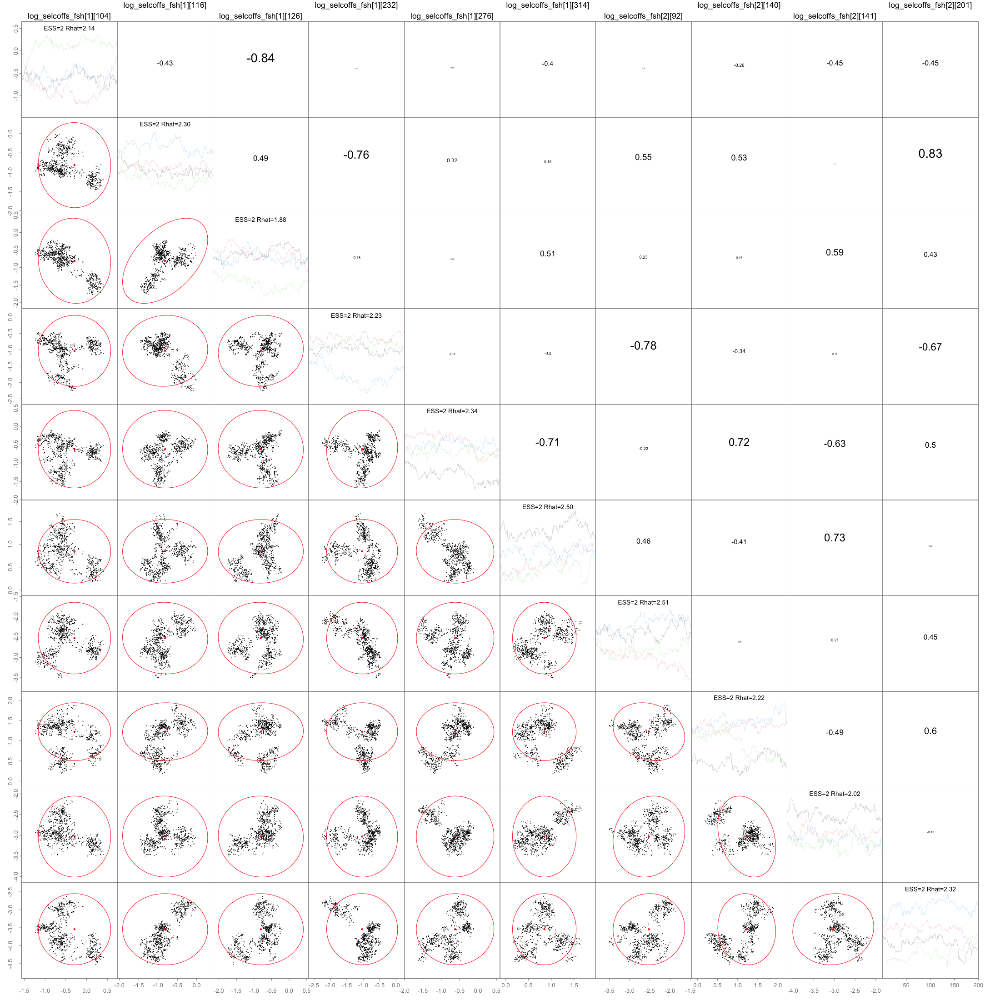
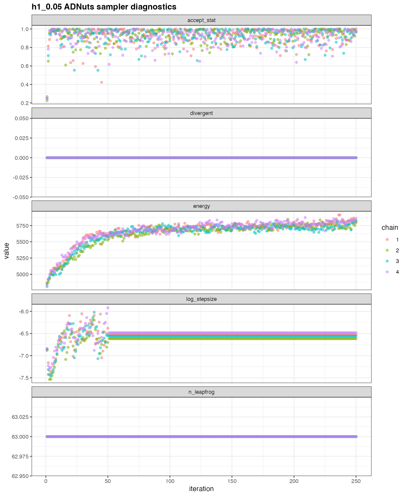
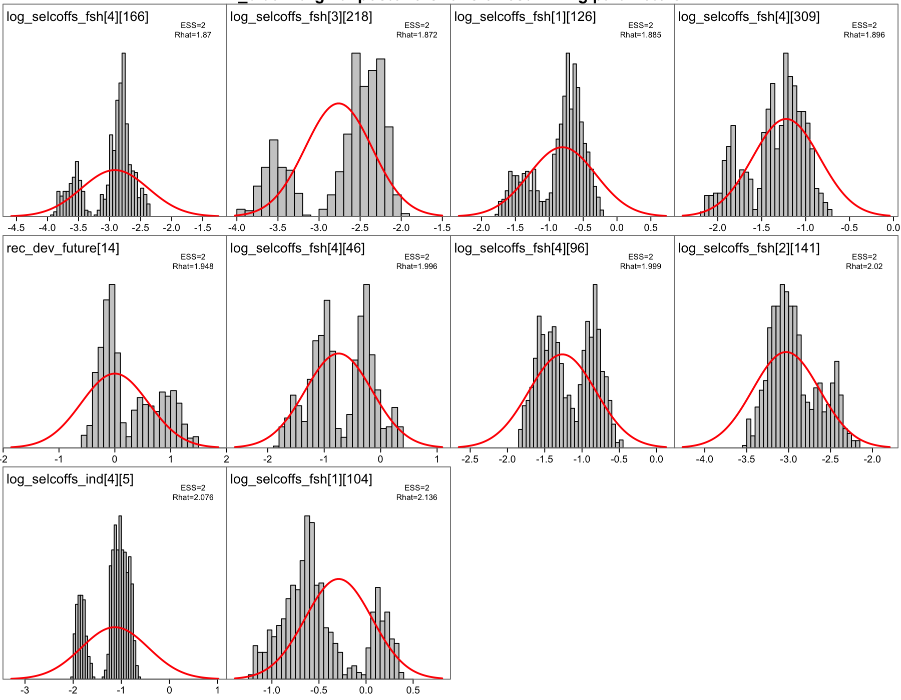
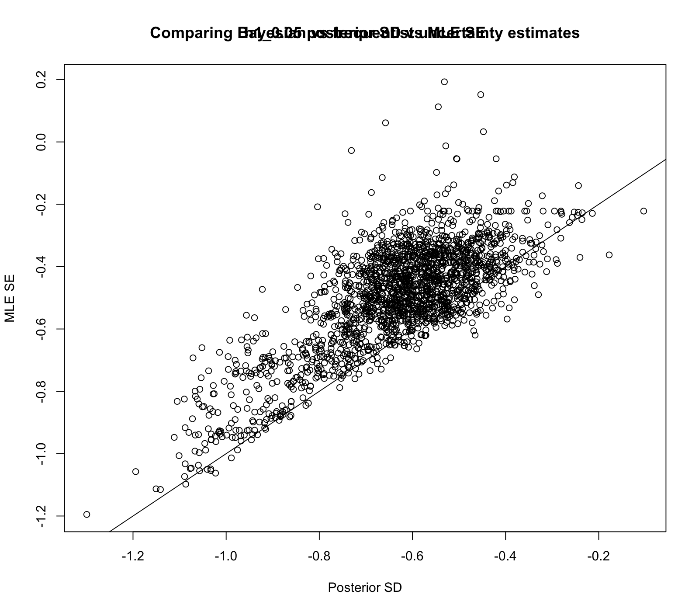
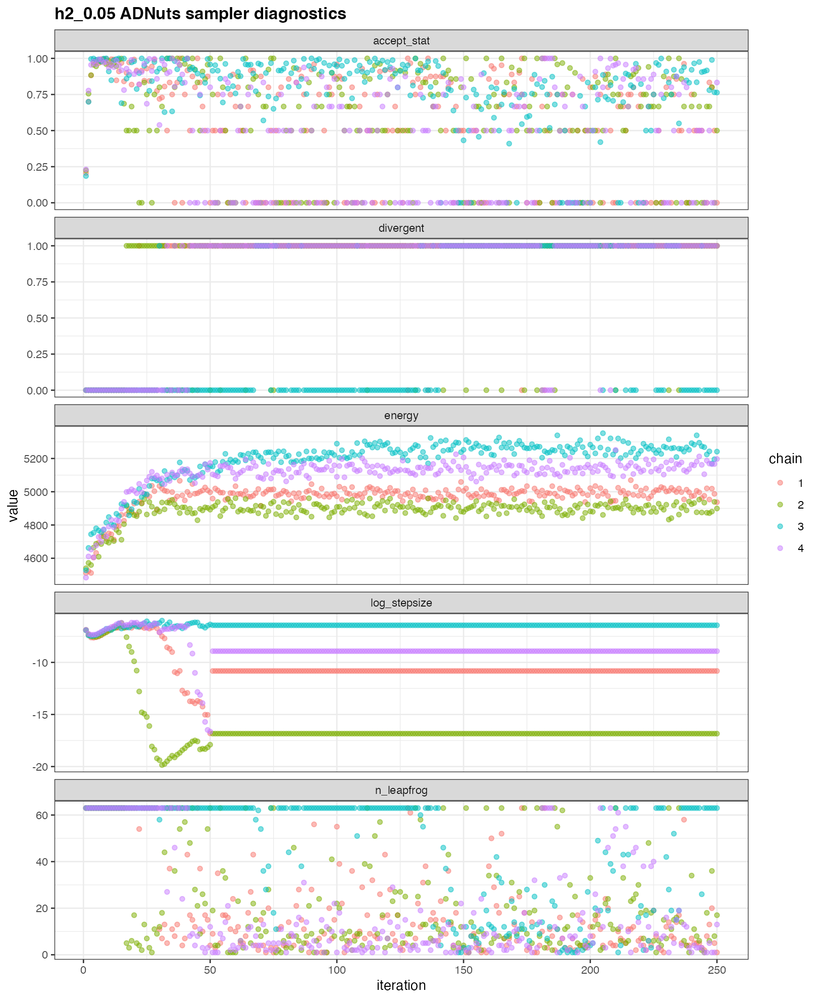
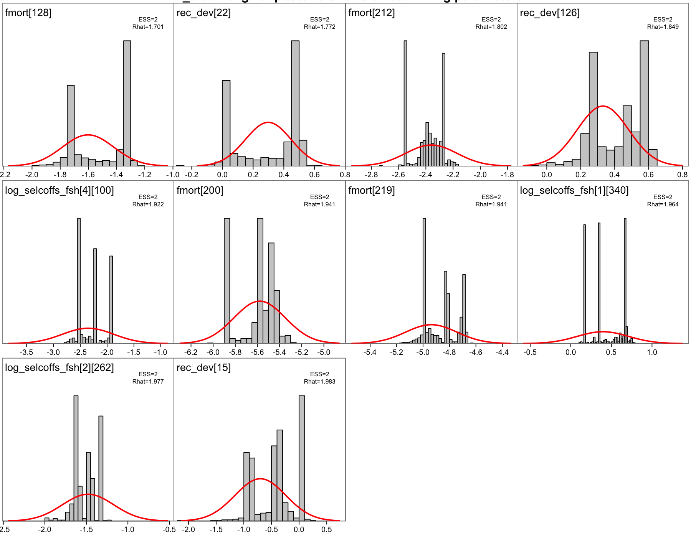
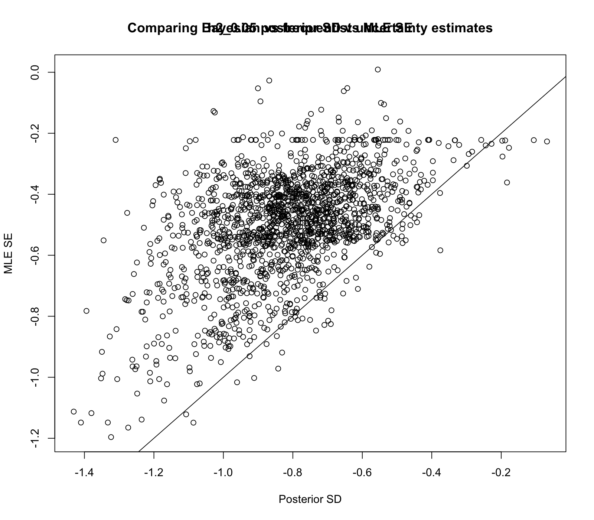

# Appendix E. 0.05 Diagnostic Figure Series

This appendix provides the diagnostic figure series for the 0.05 model set. The selection follows the requested annex figure groups and keeps the figures organized by diagnostic purpose.

| Diagnostic group | Annex figures | Appendix content |
|---|---|---|
| Retrospective patterns | 6-9 | Analytical retrospective diagnostics for spawning biomass and recruitment under the single-stock and two-stock hypotheses. |
| Input weight-at-age sanity check | 12-13 | Fishery and survey input mean weight-at-age series. |
| Composition fits | 14-27 | Fishery age fits, Far North length fits, survey age fits, and OSA/aggregate composition diagnostics. |
| Index fits | 28-29 | Single-stock index fits and combined two-stock index fits. |
| Selection patterns | 37-40 | Fishery and survey selectivity patterns under both stock hypotheses. |
| MCMC diagnostics | Additional | ADNuts sampler diagnostics, pairs plots ordered by slowest mixing parameters, marginal posteriors, and uncertainty comparisons. |

```{r}
#| label: setup-appendix-diagnostic-series
#| include: false
suppressPackageStartupMessages(library(jjmR))
source(file.path("..", "assessment", "R", "diagnostic_composition_plots.R"))

knitr::opts_chunk$set(
  fig.width = 11,
  fig.height = 9,
  out.width = "100%"
)

diag_model_id <- "0.05"
diag_h1nm <- geth(diag_model_id, "h1")
diag_h2nm <- geth(diag_model_id, "h2")

diag_config_dir <- file.path("..", "assessment", "config")
diag_input_dir <- file.path("..", "assessment", "input")
diag_output_dir <- file.path("..", "assessment", "results")

diag_required_files <- c(
  file.path(diag_config_dir, paste0(diag_h1nm, ".ctl")),
  file.path(diag_config_dir, paste0(diag_h2nm, ".ctl")),
  file.path(diag_output_dir, paste0(diag_h1nm, ".rep")),
  file.path(diag_output_dir, paste0(diag_h2nm, ".rep")),
  file.path(diag_output_dir, paste0(diag_h1nm, "_retrospective.RData")),
  file.path(diag_output_dir, paste0(diag_h2nm, "_retrospective.RData"))
)
diag_missing <- diag_required_files[!file.exists(diag_required_files)]
if (length(diag_missing)) {
  stop(
    "Missing files required for the 0.05 diagnostic appendix:\n",
    paste(diag_missing, collapse = "\n"),
    call. = FALSE
  )
}

diag_h1_mod <- readJJM(
  diag_h1nm,
  path = diag_config_dir,
  input = diag_input_dir,
  output = diag_output_dir
)
diag_h1_diag <- diagnostics(diag_h1_mod, plot = FALSE)

diag_h2_mod <- readJJM(
  diag_h2nm,
  path = diag_config_dir,
  input = diag_input_dir,
  output = diag_output_dir
)
diag_h2_diag <- diagnostics(diag_h2_mod, plot = FALSE)

diag_expected_indices <- c(
  "Chile_AcousCS", "Chile_AcousN", "Chile_CPUE", "DEPM",
  "Peru_CPUE", "Offshore_CPUE", "Peru_Acoust_S1", "Peru_Acoust_S2"
)
diag_check_indices <- function(mod, label) {
  observed <- as.character(mod[[1]]$data$Inames)
  if (!identical(observed, diag_expected_indices)) {
    stop(
      label,
      " index names do not match the expected 0.05 configuration:\n",
      "observed: ", paste(observed, collapse = ", "), "\n",
      "expected: ", paste(diag_expected_indices, collapse = ", "),
      call. = FALSE
    )
  }
}
diag_check_indices(diag_h1_mod, diag_h1nm)
diag_check_indices(diag_h2_mod, diag_h2nm)

plot_index_fit_panels <- function(diag_obj, model_name, stock_name, main, ncol = 3) {
  panel_plot <- diag_obj[[model_name]][[stock_name]]$output$predictedObservedIndices
  index_names <- as.character(panel_plot$condlevels[[1]])
  n_panels <- length(index_names)
  nrow <- ceiling(n_panels / ncol)
  op <- par(no.readonly = TRUE)
  on.exit(par(op), add = TRUE)
  par(
    mfrow = c(nrow, ncol),
    mar = c(2.4, 3.2, 1.8, 0.7),
    oma = c(2.4, 3.2, 3.2, 0.4),
    mgp = c(1.7, 0.45, 0),
    tcl = -0.25,
    cex = 0.72
  )
  for (i in seq_len(n_panels)) {
    panel_args <- panel_plot$panel.args[[i]]
    panel_groups <- panel_plot$panel.args.common$groups[panel_args$subscripts]
    panel_data <- data.frame(
      year = panel_args$x,
      value = panel_args$y,
      group = panel_groups
    )
    observed <- panel_data[panel_data$group == "obs", c("year", "value")]
    predicted <- panel_data[panel_data$group == "model", c("year", "value")]
    se <- panel_data[panel_data$group == "sd", c("year", "value")]
    names(se)[2] <- "se"
    observed_se <- merge(observed, se, by = "year", all.x = TRUE)
    x_values <- c(observed$year, predicted$year)
    y_values <- c(
      observed$value,
      predicted$value,
      observed_se$value - 1.96 * observed_se$se,
      observed_se$value + 1.96 * observed_se$se
    )
    xlim <- range(x_values[is.finite(x_values)], na.rm = TRUE)
    ylim <- range(y_values[is.finite(y_values)], na.rm = TRUE)
    if (!all(is.finite(ylim)) || diff(ylim) == 0) {
      ylim <- c(0, 1)
    }
    plot(
      NA,
      xlim = xlim,
      ylim = ylim,
      xlab = "",
      ylab = "",
      main = index_names[i],
      cex.main = 0.9,
      axes = FALSE
    )
    grid(col = "grey90")
    axis(1)
    axis(2)
    box()
    with(observed_se, {
      segments(year, value - 1.96 * se, year, value + 1.96 * se, col = "grey45")
      points(year, value, pch = 16, col = "grey55", cex = 0.65)
    })
    predicted <- predicted[order(predicted$year), ]
    lines(predicted$year, predicted$value, col = "black", lwd = 2)
  }
  for (i in seq_len(nrow * ncol - n_panels)) {
    plot.new()
  }
  mtext(main, outer = TRUE, side = 3, line = 1.2, font = 2)
  mtext("Years", outer = TRUE, side = 1, line = 1)
  mtext("Normalized index value", outer = TRUE, side = 2, line = 1.8)
  par(xpd = NA)
  legend(
    "top",
    inset = -0.02,
    legend = c("Observed", "Predicted"),
    pch = c(16, NA),
    lty = c(NA, 1),
    col = c("grey55", "black"),
    horiz = TRUE,
    bty = "n",
    lwd = c(NA, 2),
    cex = 0.9
  )
}

diag_retro_env <- new.env(parent = emptyenv())
load(file.path(diag_output_dir, paste0(diag_h1nm, "_retrospective.RData")), envir = diag_retro_env)
diag_h1_retro <- diag_retro_env$output

diag_retro_env <- new.env(parent = emptyenv())
load(file.path(diag_output_dir, paste0(diag_h2nm, "_retrospective.RData")), envir = diag_retro_env)
diag_h2_retro <- diag_retro_env$output
```

## Retrospective Patterns

```{r}
#| label: fig-diag-retro-ssb-h1
#| fig-cap: !expr paste0("Analytical retrospective of spawning biomass from five peel runs based on Model ", diag_h1nm, " under the single-stock hypothesis.")
plot(diag_h1_retro, var = "SSB")
```

```{r}
#| label: fig-diag-retro-r-h1
#| fig-cap: !expr paste0("Analytical retrospective of recruitment from five peel runs based on Model ", diag_h1nm, " under the single-stock hypothesis.")
plot(diag_h1_retro, var = "R")
```

```{r}
#| label: fig-diag-retro-ssb-h2
#| fig-cap: !expr paste0("Analytical retrospective of spawning biomass from five peel runs for the southern stock (top) and Far North stock (bottom), based on Model ", diag_h2nm, " under the two-stock hypothesis.")
#| fig-height: 10
op <- par(no.readonly = TRUE)
on.exit(par(op), add = TRUE)
par(mfrow = c(2, 1), mar = c(3, 4, 2, 1))
plot(diag_h2_retro, var = "SSB")
```

```{r}
#| label: fig-diag-retro-r-h2
#| fig-cap: !expr paste0("Analytical retrospective of recruitment from five peel runs for the southern stock (top) and Far North stock (bottom), based on Model ", diag_h2nm, " under the two-stock hypothesis.")
#| fig-height: 12
op <- par(no.readonly = TRUE)
on.exit(par(op), add = TRUE)
par(mfrow = c(2, 1), mar = c(3, 4, 2, 1))
plot(diag_h2_retro, var = "R")
```

## Input Weight-at-Age Sanity Checks

```{r}
#| label: fig-diag-wtatage-fishery
#| fig-cap: "Mean weights-at-age used for the fisheries in the JJM models. Each line represents an age from 1 to 12."
plot(diag_h1_diag, var = "weightFishery")
```

```{r}
#| label: fig-diag-wtatage-survey
#| fig-cap: "Mean weights-at-age used for the surveys in the JJM models. Each line represents an age from 1 to 12."
plot(diag_h1_diag, var = "weightAge")
```

## Composition Fits

```{r}
#| label: fig-diag-agefits-fsh-h1-n-chile
#| fig-cap: !expr paste0("Model ", diag_h1nm, " fit to age compositions for the Chilean northern zone fishery under the single-stock hypothesis.")
plot(diag_h1_diag, var = "ageFitsCatch", fleet = "N_Chile")
```

```{r}
#| label: fig-diag-agefits-fsh-h2-n-chile
#| fig-cap: !expr paste0("Model ", diag_h2nm, " fit to age compositions for the Chilean northern zone fishery under the two-stock hypothesis.")
plot(diag_h2_diag, var = "ageFitsCatch", fleet = "N_Chile")
```

```{r}
#| label: fig-diag-agefits-fsh-h1-sc-chile-ps
#| fig-cap: !expr paste0("Model ", diag_h1nm, " fit to age compositions for the South-Central Chilean purse-seine fishery under the single-stock hypothesis.")
plot(diag_h1_diag, var = "ageFitsCatch", fleet = "SC_Chile_PS")
```

```{r}
#| label: fig-diag-agefits-fsh-h2-sc-chile-ps
#| fig-cap: !expr paste0("Model ", diag_h2nm, " fit to age compositions for the South-Central Chilean purse-seine fishery under the two-stock hypothesis.")
plot(diag_h2_diag, var = "ageFitsCatch", fleet = "SC_Chile_PS")
```

```{r}
#| label: fig-diag-agefits-fsh-h1-offshore-trawl
#| fig-cap: !expr paste0("Model ", diag_h1nm, " fit to age compositions for the offshore trawl fishery under the single-stock hypothesis.")
plot(diag_h1_diag, var = "ageFitsCatch", fleet = "Offshore_Trawl")
```

```{r}
#| label: fig-diag-agefits-fsh-h2-offshore-trawl
#| fig-cap: !expr paste0("Model ", diag_h2nm, " fit to age compositions for the offshore trawl fishery under the two-stock hypothesis.")
plot(diag_h2_diag, var = "ageFitsCatch", fleet = "Offshore_Trawl")
```

```{r}
#| label: fig-diag-lenfits-fsh-h1-far-north
#| fig-cap: !expr paste0("Model ", diag_h1nm, " fit to length compositions for the Far North fishery under the single-stock hypothesis.")
plot(diag_h1_diag, var = "lengthFitsCatch")
```

```{r}
#| label: fig-diag-lenfits-fsh-h2-far-north
#| fig-cap: !expr paste0("Model ", diag_h2nm, " fit to length compositions for the Far North fishery under the two-stock hypothesis.")
plot(diag_h2_diag, var = "lengthFitsCatch")
```

```{r}
#| label: fig-diag-agefits-srv-h1-chile-acouscs
#| fig-cap: !expr paste0("Model ", diag_h1nm, " fit to age compositions for the South-Central Acoustic survey under the single-stock hypothesis.")
plot(diag_h1_diag, var = "ageFitsSurvey", fleet = "Chile_AcousCS")
```

```{r}
#| label: fig-diag-agefits-srv-h2-chile-acouscs
#| fig-cap: !expr paste0("Model ", diag_h2nm, " fit to age compositions for the South-Central Acoustic survey under the two-stock hypothesis.")
plot(diag_h2_diag, var = "ageFitsSurvey", fleet = "Chile_AcousCS")
```

```{r}
#| label: fig-diag-agefits-srv-h1-chile-acousn
#| fig-cap: !expr paste0("Model ", diag_h1nm, " fit to age compositions for the North Chilean Acoustic survey under the single-stock hypothesis.")
plot(diag_h1_diag, var = "ageFitsSurvey", fleet = "Chile_AcousN")
```

```{r}
#| label: fig-diag-agefits-srv-h2-chile-acousn
#| fig-cap: !expr paste0("Model ", diag_h2nm, " fit to age compositions for the North Chilean Acoustic survey under the two-stock hypothesis.")
plot(diag_h2_diag, var = "ageFitsSurvey", fleet = "Chile_AcousN")
```

```{r}
#| label: fig-diag-agefits-srv-h1-depm
#| fig-cap: !expr paste0("Model ", diag_h1nm, " fit to age compositions for the Daily Egg Production Method survey under the single-stock hypothesis.")
plot(diag_h1_diag, var = "ageFitsSurvey", fleet = "DEPM")
```

```{r}
#| label: fig-diag-agefits-srv-h2-depm
#| fig-cap: !expr paste0("Model ", diag_h2nm, " fit to age compositions for the Daily Egg Production Method survey under the two-stock hypothesis.")
plot(diag_h2_diag, var = "ageFitsSurvey", fleet = "DEPM")
```

## OSA and Aggregate Composition Diagnostics

These diagnostics summarize the model fits across all composition years. OSA
residuals are calculated as sequential multinomial Dunn-Smyth residuals using
the input sample sizes for each composition year. Aggregate fits use the same
sample sizes to weight observed and fitted proportions across years within each
source.

```{r}
#| label: fig-diag-osa-aggregate-h1-age
#| fig-cap: !expr paste0("OSA residual QQ diagnostics and sample-size weighted aggregate age-composition fits for Model ", diag_h1nm, " under the single-stock hypothesis.")
#| fig-width: 13
#| fig-height: 9
plot_composition_diagnostics(
  diag_h1_mod,
  stock = 1,
  comp_type = "age",
  model_label = diag_h1nm
)
```

```{r}
#| label: fig-diag-osa-aggregate-h1-length
#| fig-cap: !expr paste0("OSA residual QQ diagnostics and sample-size weighted aggregate length-composition fits for Model ", diag_h1nm, " under the single-stock hypothesis.")
#| fig-width: 13
#| fig-height: 9
plot_composition_diagnostics(
  diag_h1_mod,
  stock = 1,
  comp_type = "length",
  model_label = diag_h1nm
)
```

```{r}
#| label: fig-diag-osa-aggregate-h2-south-age
#| fig-cap: !expr paste0("OSA residual QQ diagnostics and sample-size weighted aggregate age-composition fits for the southern stock in Model ", diag_h2nm, " under the two-stock hypothesis.")
#| fig-width: 13
#| fig-height: 9
plot_composition_diagnostics(
  diag_h2_mod,
  stock = 1,
  comp_type = "age",
  model_label = paste(diag_h2nm, "southern stock")
)
```

```{r}
#| label: fig-diag-osa-aggregate-h2-farnorth-length
#| fig-cap: !expr paste0("OSA residual QQ diagnostics and sample-size weighted aggregate length-composition fits for the Far North stock in Model ", diag_h2nm, " under the two-stock hypothesis.")
#| fig-width: 13
#| fig-height: 9
plot_composition_diagnostics(
  diag_h2_mod,
  stock = 2,
  comp_type = "length",
  model_label = paste(diag_h2nm, "Far North stock")
)
```

## Index Fits

```{r}
#| label: fig-diag-indfits-h1
#| fig-cap: !expr paste0("Model ", diag_h1nm, " fit to abundance indices under the single-stock hypothesis. Vertical bars represent two standard deviations around the observations.")
#| fig-width: 11
#| fig-height: 9
plot_index_fit_panels(
  diag_h1_diag,
  model_name = diag_h1nm,
  stock_name = "Stock_1",
  main = paste0("Predicted and observed indices: ", diag_h1nm, " single-stock hypothesis")
)
```

```{r}
#| label: fig-diag-indfits-h2
#| fig-cap: !expr paste0("Model ", diag_h2nm, " fit to abundance indices under the two-stock hypothesis. Vertical bars represent two standard deviations around the observations.")
#| fig-width: 11
#| fig-height: 14
plot_index_fit_panels(
  diag_h2_diag,
  model_name = diag_h2nm,
  stock_name = "Stock_1",
  main = paste0("Predicted and observed indices: ", diag_h2nm, " southern stock")
)
plot_index_fit_panels(
  diag_h2_diag,
  model_name = diag_h2nm,
  stock_name = "Stock_2",
  main = paste0("Predicted and observed indices: ", diag_h2nm, " Far North stock")
)
```

## Selection Patterns

```{r}
#| label: fig-diag-selfsh-h1
#| fig-cap: !expr paste0("Estimated fishery selectivity over time for Model ", diag_h1nm, " under the single-stock hypothesis.")
print(plot_selectivities(get_selectivities(diag_h1_mod)))
```

```{r}
#| label: fig-diag-selfsh-h2
#| fig-cap: !expr paste0("Estimated fishery selectivity over time for Model ", diag_h2nm, " under the two-stock hypothesis.")
print(plot_selectivities(get_selectivities(diag_h2_mod)))
```

```{r}
#| label: fig-diag-selsrv-h1
#| fig-cap: !expr paste0("Estimated survey selectivity over time for Model ", diag_h1nm, " under the single-stock hypothesis.")
plot(diag_h1_mod, what = "selectivity", fleet = "ind", alpha = 0.2, scale = 10)
```

```{r}
#| label: fig-diag-selsrv-h2
#| fig-cap: !expr paste0("Estimated survey selectivity over time for Model ", diag_h2nm, " under the two-stock hypothesis.")
plot(diag_h2_mod, what = "selectivity", fleet = "ind", alpha = 0.2, scale = 10)
```

## ADNuts MCMC Diagnostics

ADNuts diagnostic chains were run for `h1_0.05` and `h2_0.05` with four chains,
250 iterations, 50 warmup iterations, unit metric, `adapt_delta = 0.9`, and
`max_treedepth = 6`. These short runs are included as sampler diagnostics and
are not suitable for posterior inference. The single-stock run had no
post-warmup divergences but reached maximum treedepth on all iterations. The
two-stock run had many post-warmup divergences. Both runs had low effective
sample sizes and high Rhat values, so longer and better tuned runs would be
required before using MCMC output for inference.

```{r}
#| label: tbl-diag-adnuts-mcmc-summary
#| tbl-cap: "ADNuts MCMC diagnostic run summary for the 0.05 model pair. These short chains are intended for convergence diagnostics, not posterior inference."
#| results: asis
adnuts_summary <- read.csv(file.path("data", "adnuts_mcmc_summary.csv"))
adnuts_summary |>
  dplyr::transmute(
    model,
    chains,
    iter,
    warmup,
    post_warmup_per_chain,
    n_parameters,
    divergences,
    max_treedepth_hits,
    max_rhat = round(max_rhat, 3),
    min_bulk_ess,
    median_bulk_ess,
    wall_minutes = round(wall_seconds / 60, 1)
  ) |>
  knitr::kable()
```

```{r}
#| label: tbl-diag-adnuts-mcmc-slow-parameters
#| tbl-cap: "Ten slowest-mixing parameters retained from each ADNuts fit for the 0.05 model pair."
#| results: asis
adnuts_slow <- read.csv(file.path("data", "adnuts_mcmc_slow_parameters.csv"))
adnuts_slow |>
  dplyr::mutate(Rhat = round(Rhat, 3)) |>
  knitr::kable()
```

{#fig-diag-adnuts-h1-pairs-slow width=100%}

{#fig-diag-adnuts-h1-sampler width=100%}

{#fig-diag-adnuts-h1-marginals width=100%}

{#fig-diag-adnuts-h1-uncertainties width=100%}

{#fig-diag-adnuts-h2-pairs-slow width=100%}

{#fig-diag-adnuts-h2-sampler width=100%}

{#fig-diag-adnuts-h2-marginals width=100%}

{#fig-diag-adnuts-h2-uncertainties width=100%}
